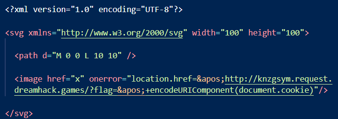
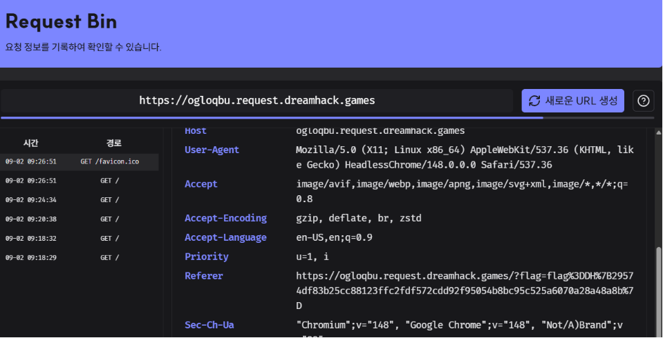
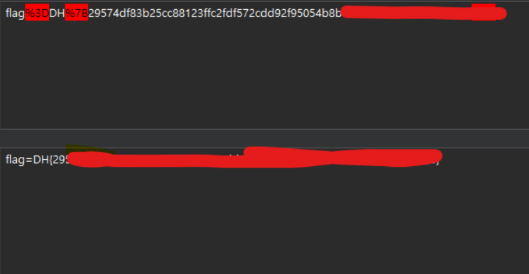

# PTML Write-up

## 1. Overview

* **Target Challenge:** PTML
* **Category:** Web Hacking
* **Key Concept:** PyScript DOMParser Bypass / Stored XSS / Cookie Exfiltration

---

## 2. Vulnerability Analysis

### Endpoint

* `/`
* `/upload`
* `/uploads/<filename>`
* `/static/main.py`

### Source Code Analysis

서비스의 동작과 소스 코드를 분석했습니다.

#### `app.py`

```python
@app.route('/upload', methods=['POST'])
def upload_file():
    ...
    # 파일 업로드 시 UUID를 결합하여 저장 후 Bot 실행
    unique_filename = f"{unique_id}_{filename}"
    file_path = os.path.join(app.config['UPLOAD_FOLDER'], unique_filename)
    file.save(file_path)

    read_file(unique_filename)

    return redirect(url_for('index', file=f'uploads/{unique_filename}'))


def read_file(filename):
    # Bot에 FLAG 쿠키 주입 후 접속
    cookie = {
        "name": "flag",
        "value": FLAG
    }

    cookie.update({
        "domain": "127.0.0.1"
    })

    ...

    driver.get(f"http://127.0.0.1:8000/?file=uploads/{filename}")

    WebDriverWait(driver, 10).until(
        EC.presence_of_element_located((By.TAG_NAME, "svg"))
    )
```

파일이 업로드되면 UUID가 포함된 이름으로 저장됩니다.

이후 `read_file()` 함수가 실행되며 Bot에 `flag` 쿠키를 설정한 뒤 업로드된 SVG 파일이 포함된 페이지에 접근합니다.

#### `main.py`

```python
def load_svg_from_string(svg_string):
    parser = DOMParser.new()

    # [Point 1] Strict XML 파싱
    # 문법 오류 발생 시 <parsererror> 태그 생성
    doc = parser.parseFromString(svg_string, "image/svg+xml")

    # 태그 화이트리스트 검사
    # <script> 태그는 허용되지 않음
    allowed_elements = [
        "svg", "path", "rect", "circle", "ellipse", "line",
        "polyline", "polygon", "text", "tspan", "textPath",
        "altGlyph", "altGlyphDef", "altGlyphItem", "glyphRef",
        "altGlyph", "animate", "animateColor", "animateMotion",
        "animateTransform", "mpath", "set", "desc", "title",
        "metadata", "defs", "g", "symbol", "use", "image",
        "switch", "style"
    ]

    elements = doc.getElementsByTagName("*")

    for element in elements:
        if element.tagName not in allowed_elements:
            raise ValueError(
                f"Disallowed SVG element found: {element.tagName}"
            )

    return doc.documentElement
```

SVG 문자열은 `DOMParser`를 이용해 `image/svg+xml` 형식으로 파싱됩니다.

이후 SVG 내부의 모든 요소를 검사하여 `allowed_elements`에 존재하지 않는 태그가 발견되면 예외를 발생시킵니다.

하지만 이 검증 방식은 **태그 이름만 검사하고 속성(attribute)은 검사하지 않습니다.**

따라서 `<script>` 태그 자체는 차단되지만, 허용된 SVG 요소에 이벤트 핸들러를 삽입하는 방식은 별도로 차단되지 않습니다.

---

## 3. Proof of Concept (PoC)

`<script>` 태그 대신 화이트리스트에 포함된 `<image>` 태그의 이벤트 핸들러를 활용했습니다.

또한 `DOMParser`가 XML 파싱 과정에서 `<parsererror>`를 생성하지 않도록 속성 값 내부에서 필요한 문자를 XML 엔티티 형태로 처리했습니다.

추가로 `SvgMover` 로직에서 오류가 발생하지 않도록 `<path>` 요소를 함께 포함하여 `exploit.svg`를 구성했습니다.

Payload 작성 및 테스트에는 Dreamhack Tools를 사용했습니다.

https://tools.dreamhack.games/



---

## 4. Execution & Result

작성한 `exploit.svg` 파일을 웹 인터페이스를 통해 업로드했습니다.

SVG 파일은 `main.py`의 태그 화이트리스트 검증을 통과하였으며, 이후 동기적으로 실행된 Bot이 업로드된 파일을 포함한 페이지에 접근했습니다.

그 결과 SVG에 포함된 이벤트 핸들러가 실행되었습니다.

RequestBin에서 수신된 요청을 확인한 결과 요청 정보에서 URL 인코딩된 값이 전달된 것을 확인할 수 있었습니다.



전달된 값을 URL Decode한 결과 최종적으로 FLAG를 획득할 수 있었습니다.



---

## 5. Takeaways

### SVG 이벤트 핸들러에 대한 검증 필요

`<script>` 태그를 차단하는 것만으로는 SVG 기반 XSS를 충분히 방지할 수 없습니다.

SVG에서는 `<image>`, `<svg>` 등 허용된 요소에도 `onerror`, `onload`와 같은 이벤트 핸들러 속성을 사용할 수 있기 때문입니다.

따라서 단순한 **태그 단위 화이트리스트 검증**뿐만 아니라, 이벤트 핸들러 및 위험한 속성을 제거하는 **속성 단위 Sanitization**이 필요합니다.

예를 들어 DOMPurify와 같은 검증된 Sanitizer를 적용하는 방법을 고려할 수 있습니다.

### DOMParser 파싱 오류 처리 필요

`DOMParser`를 `image/svg+xml` 모드로 사용할 경우 올바르지 않은 XML 문법이 입력되면 `<parsererror>` 요소가 생성될 수 있습니다.

따라서 파싱 이후 결과를 그대로 신뢰하지 않고 `<parsererror>` 존재 여부를 명확하게 확인한 뒤 SVG 검증 로직을 수행해야 합니다.

즉, **XML 문법 검증과 SVG 보안 검증을 별도의 단계로 분리하는 것이 안전합니다.**
