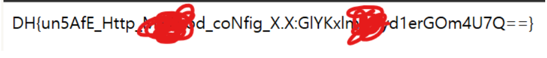

## 1. Overview
* **Target Challenge:** Really Not SQL 
* **Category:** Web Hacking
* **Key Concept:** JSON 기반의 비인가 세션 승격(Broken Authentication / Privilege Escalation)

---

## 2. Vulnerability Analysis

### Endpoint
* `/flag.php`
* `/user/admin.json`
* `/user/guest.json`
* `/edit_profile.php`
* `/login.php`
* `/index.php`

### Source Code Analysis
서비스 동작 및 코드 분석

index.php 파일도 존재하지만 환영한다는 메인페이지 로직이라 분석을 생략함

## [login.php]
```
<?php
session_start();

if ($_SERVER['REQUEST_METHOD'] === 'POST') {          # POST 메서드 요청 처리
    $userDir = __DIR__ . '/user/';
    $username = $_POST['username'] ?? '';            # POST 요청에서 ID 수신
    $password = $_POST['password'] ?? '';            # POST 요청에서 PW 수신

    $filename = $username . '.json';                # 파일이름 및 경로 생성
    $filepath = $userDir . $filename;

    if ($username !== "admin" && $username !== "guest") {  # admin, guest가 아니면 User not found 출력
        $error = "User not found";
    } else {
        # [수정 위치] 유저를 찾았을 때 filepath 경로의 json 파일 내용을 가져와 배열로 디코딩 후 userData에 저장
        $userData = json_decode(file_get_contents($filepath), true);
        
        if ($userData['id'] !== $username){    # json 내부 id와 로그인 시도 id가 다르면
            # Error occured 에러구문 출력
            $error = "Error occured";
        } else if ($userData['password'] !== hash("sha256", $password)) { # 입력한 PW의 SHA-256 해시값과 json 내부 password가 다르면
            $error = "Invalid password";       # Invalid password 에러구문 출력
        } else {
            $_SESSION['user'] = $username;     # 검증 성공 시 세션에 유저 ID 저장
            $success = true;
        }
    }
    
}
?>

<?php if ($error): ?>
<script>
    alert("<?= $error ?>");                   # 에러 발생 시 알림창 출력
</script>
<?php elseif ($success): ?>
<script>
    alert("Hello <?= $username ?>");          # 성공 시 Hello [username] 알림창 출력 후 메인으로 이동
    window.location.href = "/";
</script>
<?php endif; ?>

```
## [edit_profile.php]
```
<?php
session_start();

# 세션 검증: 로그인한 유저가 admin이 아닐 경우 권한 에러 메시지 설정 (접근 차단)
if ($_SESSION['user'] !== "admin") {
    $error = "Only admin can edit user profile";
}

# POST 요청이면서 로그인한 유저가 admin일 경우 프로필 수정 로직 실행
if ($_SERVER['REQUEST_METHOD'] === 'POST' && $_SESSION['user'] === "admin") {
    $userDir = __DIR__ . '/user/';
    $username = $_POST['username'] ?? '';    # 수정 대상 유저 ID 수신
    $password = $_POST['password'] ?? '';    # 변경할 새 비밀번호 수신

    $filename = $username . '.json';        # 대상 유저의 JSON 파일명 생성
    $filepath = $userDir . $filename;        # 대상 유저의 JSON 파일 경로 생성

    # 대상 유저 검증: admin 또는 guest 계정만 수정 가능하도록 제한
    if ($username !== "admin" && $username !== "guest") {
        $error = "User not found";
    } else {
        # 대상 유저의 JSON 파일 내용을 읽어와 배열로 변환
        $userData = json_decode(file_get_contents($filepath), true);

        # JSON 내부 id 값과 입력받은 username이 일치하는지 확인
        if ($userData['id'] !== $username){
            $error = "Error occured";
        }
        else {
            # 새 비밀번호를 SHA-256 해시로 변환하여 userData 배열에 저장
            $userData['password'] = hash("sha256", $password);
            # 변경된 userData 배열을 JSON 형식으로 다시 파일에 덮어씀
            file_put_contents($filepath, json_encode($userData));
            $success = true;
        }
    }
}
?>

```
## [flag.php]
```

# admin이 아닐시 403 / admin이 맞으면 flag가 존재할 가능성이 있음
<?php 
session_start();

if ($_SESSION['user'] !== "admin") {
    http_response_code(403);
} else {
    $file = file_get_contents('/flag');
    echo trim($file); 
}

?>
```
## [admin.json]
`{"no": 0, "id": "admin", "password": "285a378cf7a63c69502be1885ef9c23abe27e07e141effb6e56545b1dd66dce8"}`

## [guest.json]
`{"no": 1, "id": "guest", "password": "84983c60f7daadc1cb8698621f802c0d9f9a3c3c295c810748fb048115c186ec"}`

---

## 3. Proof of Concept (PoC)
소스코드를 보았을때 admin, guest (Json) 먼저 확인했다 해쉬로된 pw와 id(admin, guest)가 있었다.
해쉬값을 분석해서 로그인에 성공하라는 의미인거 같았다 당연히 flag가 있을 확률이 높은 admin부터 시도했다. 
crackstation 사이트를 이용하였다.

#### admin 출력 결과


Not found로 존재하지 않는다라는 문구가 떳다.

#### guest 출력 결과


guest는 pw는 guest인거 같았다.

여기서 의문은 왜 admin은 존재하지 않은 비번일까? 생각이 들었고 이건 함정이구나라는 생각이 들었다.

소스코드를 분석한 결과를 토대로 생각난 시나리오는 flag.php에 flag가 높을 확률이 높고 flag를 얻으려면 일단 admin으로 로그인을 해야한다 그러나 admin 해쉬Pw는 존재하지 않지만 guest는 해쉬Pw가 존재하기 때문에 이걸 이용해서 권한상승을 하면 되겠다는 것이다.

cmd에서 이용할 Payload를 작성하였다.
`curl -X PUT http://host3.dreamhack.games:12071/user/admin.json -d "{\"no\": 0, \"id\": \"admin\", \"password\": \"84983c60f7daadc1cb8698621f802c0d9f9a3c3c295c810748fb048115c186ec\"}`

PUT 메서드를 사용하는 이유중 하나는 문제파일에 000-default.conf에 DAV on이라는 것때문에 사용을 하였음.


왜냐면 이 기능은 서버의 파일/디렉터리를 수정, 이동, 삭제, 업로드(PUT), 다운로드하는 등의 작업을 수행할 수 있기 때문입니다. 


로그인한 결과 Hello admin 팝업창과 함께 admin으로 로그인을 성공한 것을 알 수 있었다.

그 다음 /flag.php 경로로 이동해 봤더니..

+ 참고로 /user/admin.json & guest.json은 소스코드에 제공된 것과 동일하여 따로 첨부하진 않았음.

---

## 4. **Execution & Result**

flag를 획득 할 수 있었다.

---

## 5. **Takeaways**
* 인증 메커니즘 및 파일 접근 제어 미흡

JSON 등 플랫 파일 기반으로 유저 정보를 관리할 때, 민감한 파일(/user/admin.json)이 웹 루트 하위에 노출되면 비인가 세션 승격 및 권한 상승(Privilege Escalation) 위험이 발생함.

* 단순 해시 함수 사용의 한계 및 Salt 적용 필요성

SHA-256 같은 단방향 해시 함수만 사용할 경우 레인보우 테이블이나 사전에 의해 크랙될 위험이 있음. 따라서 난수(Salt)를 추가하거나 bcrypt, argon2 같은 전용 패스워드 해싱 알고리즘을 적용해야 함.

또한, 이번 문제처럼 해시값 자체를 웹에서 직접 조회 및 교체(file_put_contents)할 수 없도록 파일 시스템 권한 분리 및 DBMS 도입이 필수적임.
