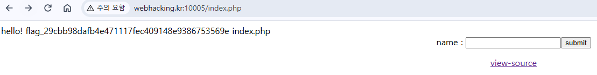

http://webhacking.kr:10005/?view_source=1

# Webhacking.kr Chal44

## 1. 문제 정보
```
<?php
  if($_GET['view_source']){ highlight_file(__FILE__); exit; }
?><html>
<head>
<title>Challenge 44</title>
</head>
<body>
<?php
  if($_POST['id']){
    $id = $_POST['id'];
    $id = substr($id,0,5);
    system("echo 'hello! {$id}'"); // You just need to execute ls
  }
?>
<center>
<form method=post action=index.php name=htmlfrm>
name : <input name=id type=text maxlength=5><input type=submit value='submit'>
</form>
<a href=./?view_source=1>view-source</a>
</center>
</body>
</html>
```
---

## 2. 취약점

system()으로 받은 문자열은 /bin/sh -c 로 실행됨. 문자열취급이아닌 명령어로

echo 'hello! []' 에서 '를 추가입력해서 escape

---

## 3. 분석 과정

원본명령 echo 'hello! +{입력값}'
문자열을 나가려면 맨앞에 ' 를 넣어서 따옴표를 닫는다

문법오류 방지위해서 마지막에 하나 더 넣어준다

명령어 이어서 실행하는 ; (순차실행)
아니면 백그라운드 실행 & 써준다 

```';ls'```

(길이제한 5글자)
---

## 4. 풀이 과정

```';ls'``` 입력 시 


flag포함 경로가나옴

---
## 5. 대응 방안

근본원인은 사용자입력을 쉘명령문자열에 이어붙혀서 취약점이 터진다.

1. shell호출 자체를 제거한다
```echo "hello! " . htmlspecialchars($id, ENT_QUOTES, 'UTF-8');```
2. system명령어를 써야한다면 인자 escape해야한다
```system("echo " . escapeshellarg("hello! " . $id));```