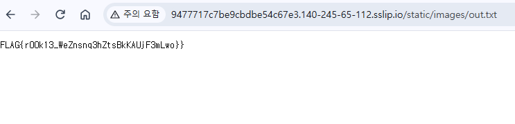

# LemonThinker-Source Writeup

## 문제 정보
- LemonThinker
- 텍스트를 입력하면 이미지로 만들어주는 Flask 앱

## 취약점 / 핵심 아이디어
`app.py`에서 사용자 입력을 `os.system`으로 쉘에 그대로 전달. 필터는 `"` 제거밖에없음, 큰따옴표 안에서도 `$()`·백틱은 실행됨 → **Command Injection**.


## 분석 과정
"만 막혀서 따옴표 탈출은 불가하지만, $()/백틱은 큰따옴표 내부에서도 명령 치환됨.
앱은 ctf 유저로 실행, /flag.txt도 ctf 소유 → 읽기 가능.
응답엔 출력이 안 나옴(blind) → 결과를 static 파일로 빼내기.

## 풀이과정
input에 os injection → 플래그를 static/images/out.txt로 보낸다음
/static/images/out.txt 접속해 평문으로 읽기.

## Payload
```$(cat /flag.txt > static/images/out.txt)``` 아니면 ``` `cat /flag.txt > static/images/out.txt` ```



## 대안

```os.system(f"")``` 방식을 쓰지않기
shell=False 써야지 $() 나 `` 무력화됨
