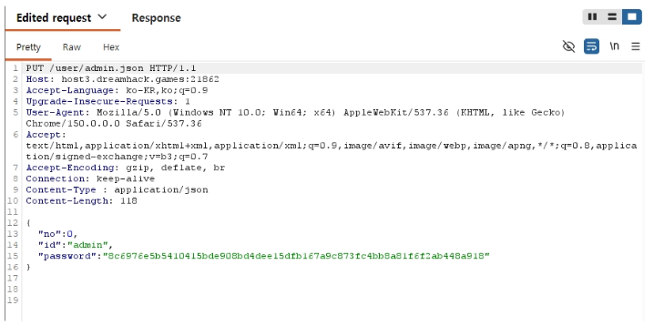
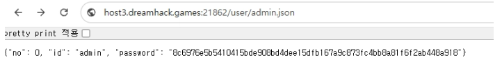
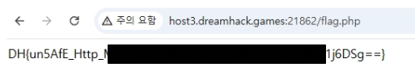

# Really Not SQL

구분: 개인 문제<br>
난이도: Easy<br>
분야: Web<br>
상태: 작성 완료<br>
작성일: 2026년 09월 06일<br>
<br>

# 0. 문제 정보

# 문제 정보

| 항목 | 내용 |
| --- | --- |
| 문제명 | Really Not SQL |
| 원본 대회 |  |
| 분야 | Web |
| 난이도 | 초급 · 약 1/5 |
| 접속 주소 | `https://dreamhack.io/wargame/challenges/2105` |
| 플래그 형식 | `DH{...}` |

# 1. 문제 요약

- admin 또는 guest로 로그인 가능
- admin 계정 정보가 있는 파일을 위조하여 admin으로 로그인 후 플래그 획득

---
# 2. 문제 분석
**주요 코드**
```php
# login.php
<?php
session_start();

if ($_SERVER['REQUEST_METHOD'] === 'POST') {
    $userDir = __DIR__ . '/user/';
    $username = $_POST['username'] ?? '';
    $password = $_POST['password'] ?? '';

    $filename = $username . '.json';
    $filepath = $userDir . $filename;

    if ($username !== "admin" && $username !== "guest") {
        $error = "User not found";
    } else {
        $userData = json_decode(file_get_contents($filepath), true);
        if ($userData['id'] !== $username){
            $error = "Error occured";
        } else if ($userData['password'] !== hash("sha256", $password)) {
            $error = "Invalid password";
        } else {
            $_SESSION['user'] = $username;
            $success = true;
        }
    }
    
}
?>
...
```
```php
# edit_profile.php
<?php
session_start();

if ($_SESSION['user'] !== "admin") {
    $error = "Only admin can edit user profile";
}

if ($_SERVER['REQUEST_METHOD'] === 'POST' && $_SESSION['user'] === "admin") {
    $userDir = __DIR__ . '/user/';
    $username = $_POST['username'] ?? '';
    $password = $_POST['password'] ?? '';

    $filename = $username . '.json';
    $filepath = $userDir . $filename;

    if ($username !== "admin" && $username !== "guest") {
        $error = "User not found";
    } else {
        $userData = json_decode(file_get_contents($filepath), true);

        if ($userData['id'] !== $username){
            $error = "Error occured";
        }
        else {
            $userData['password'] = hash("sha256", $password);
            file_put_contents($filepath, json_encode($userData));
            $success = true;
        }
    }
}
?>
...
```
```php
# flag.php
<?php 
session_start();

if ($_SESSION['user'] !== "admin") {
    http_response_code(403);
} else {
    $file = file_get_contents('/flag');
    echo trim($file); 
}

?>
```
플래그를 얻기 위해서는 `/flag`로 접근해야 하는데, admin으로 로그인한 상태가 아니면 403 코드만 온다.<br>
admin, guest의 계정정보는 json으로 작성되어있고 외부에서 확인 가능하나, 비밀번호는 해쉬값이 저장되므로 admin의 비밀번호를 알아내기는 힘들다.<br>
---
# 3. 풀이
문제를 풀기 위해서는 현재 문제에 적용된 설정을 확인해야 한다.
```
# 000-default.conf
  <Directory /var/www/html/user/>
      DAV On
      Options Indexes
      AllowOverride All
      Require all granted
  </Directory>
</VirtualHost>
```
서버 설정 파일 중 일부로, `DAV on` 인 것을 확인할 수 있다.<br>
이는 WebDAV를 활성화시키는 것으로, 이때 WebDEV는 클라이언트가 웹 서버의 자원을 생성, 수정 등을 할 수 있도록 하는 기술이다.<br>
`Require all granted`도 설정되어있기 때문에 별도의 인증 없이 파일을 수정할수 있다.<br>
이를 이용하기 위해 burp suite를 이용해 다음과 같은 요청을 보낸다.

HTTP 메소드는 PUT으로 바꾼 후 `Content-type: application/json` 을 추가해 내가 원하는 비밀번호의 sha256 해쉬값을 넣은 json 데이터를 보낸다.<br>
이때 비밀번호는 ‘admin’의 sha256 해쉬값이다.<br>

해당 요청 이후 다시 admin.json에 접근해보면 다음과 같이 값이 바뀐 것을 확인할 수 있다.

비밀번호가 바뀌었으므로 admin으로 로그인하여 플래그를 얻을 수 있다.
