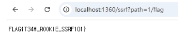

# SSRF101

구분: 공통 문제<br>
난이도: Easy<br>
분야: Web<br>
상태: 작성 완료<br>
작성일: 2026년 09월 06일<br>
<br>

# 0. 문제 정보

# 문제 정보

| 항목 | 내용 |
| --- | --- |
| 문제명 | SSRF101 |
| 원본 대회 | WolvCTF 2022 |
| 분야 | Web |
| 난이도 | 초급 · 약 1/5 |
| 접속 주소 | `http://localhost:1360` |
| 플래그 형식 | `FLAG{...}` |

# 1. 문제 요약

- Servder Side Request를 사용자 입력을 통해 생성
- 요청을 위조하여 플래그를 획득

---

# 2. 문제 분석
**주요 코드**
```python
const private1Port = 1001

app.get('/ssrf', (req, res) => {
    const path = req.query.path
    if (typeof path !== 'string' || path.length === 0) {
        res.send('path must be a non-empty string')
    }
    else {
        const url = `http://localhost:${private1Port}${path}`
        const parsedUrl = new URL(url)
...
```
`/ssrf?path=`로 요청하면 `http://localhost:1001<path>`형태로 만들어 요청을 보내 `private1.js로 접근한다.`
```python
const private2Port = 10011

app.get('/flag', (req, res) => {
    res.sendFile(__dirname + '/flag.txt')
})
```
플래그를 얻기 위해서는 10011 포트로 접근하여 `/flag` 요청을 보내야 한다.
---
# 3. 풀이
요청 url을 만드는 과정에서 포트 뒤에 path를 별도의 검사 없이 바로 붙이고 있다.<br>
따라서 path를 `1/flag`로 입력하면 최종 url이 `http://localhost:10011/flag`가 되어 플래그를 얻을 수 있다.
