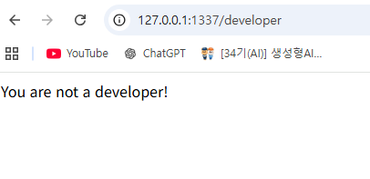

# render

# 0. 문제 정보

| 항목 | 내용 |
| --- | --- |
| 문제명 | Renderer |
| 분야 | Web |
| 난이도 | 초급 · 약 1.5/5 |
| 접속 주소 | `http://localhost:1337` |
| 플래그 형식 | `FLAG{...}` |
| 원본대회 | scriptCTF2025 |

Renderer는 사용자가 입력하거나 선택한 데이터를 웹 페이지에 표시하는 서비스입니다.

서비스의 동작 과정에서 발생하는 잘못된 검증 또는 접근 제어를 찾아 서버에 저장된 플래그를 획득하는 것이 목표입니다.

# 1. 문제 요약

- 문제는 웹서버에서 /developer 엔드포인트에서 인증을 통과해 flag를 얻는 문제이다
- /developer엔드포인트에서 developer_secret_cookie쿠키를 통해서 검증한다.
- 쿠키는 ./static/uploads/secrets/secret_cookie.txt에 저장된다
- ./static폴더라 url요청을 통해서도 요청 가능하며 /render/엔드포인트로도 접근 가능하다.

---

# 2. 문제 분석

- 전체코드
    
    ```jsx
    from flask import Flask, request, redirect, render_template, make_response, url_for
    app = Flask(__name__)
    from hashlib import sha256
    import os
    
    def allowed(name):
        if name.split('.')[1] in ['jpg','jpeg','png','svg']:
            return True
        return False
    
    @app.route('/',methods=['GET','POST'])
    def upload():
        if request.method == 'POST':
            if 'file' not in request.files:
                return redirect(request.url)
            file = request.files['file']
            if file.filename == '':
                return redirect(request.url)
            if file and allowed(file.filename):
                filename = file.filename
                hash = sha256(os.urandom(32)).hexdigest()
                filepath = f'./static/uploads/{hash}.{filename.split(".")[1]}'
                file.save(filepath)
                return redirect(f'/render/{hash}.{filename.split(".")[1]}')
        return render_template('upload.html')
    
    @app.route('/render/<path:filename>')
    def render(filename):
        return render_template('display.html', filename=filename)
    
    @app.route('/developer')
    def developer():
        cookie = request.cookies.get("developer_secret_cookie")
        correct = open('./static/uploads/secrets/secret_cookie.txt').read()
        if correct == '':
            c = open('./static/uploads/secrets/secret_cookie.txt','w')
            c.write(sha256(os.urandom(16)).hexdigest())
            c.close()
        correct = open('./static/uploads/secrets/secret_cookie.txt').read()
        if cookie == correct:
            c = open('./static/uploads/secrets/secret_cookie.txt','w')
            c.write(sha256(os.urandom(16)).hexdigest())
            c.close()
            return f"Welcome! There is currently 1 unread message: {open('flag.txt').read()}"
        else:
            return "You are not a developer!"
    
    if __name__ == '__main__':
        app.run(host='0.0.0.0', port=1337)
    ```
    

웹서버

```jsx
Flask - / (파일 업로드가 가능한 엔드포인트로 allow 화이트리스트와 해쉬를 통한 파일 이름 변경을 하고 있다 그리고 파일을 올리면 render로 리다이렉트한다)
			- /render/<path:filename> (파일을 렌더링해주는 페이지로 render_template함수로 upload.html을 렌더링한다.)
			- /developer (cookie값을 통해 사용자가 developer인지 아닌지 확인한다.)		
```

---

# 3. 풀이과정

1. developer에 들어가 ./static/uploads/secrets/secret_cookie.txt값을 쓴다. 
2. /render 엔드포인트를 이용하거나 static이나까 직접 접근으로 secret_cookie을 확인한다
3. 확인한 secret_cookie값을 바탕으로 쿠키값을 위조해 /developer엔드포인트 검증을 통과한다.5

## 3-1 cookie값 쓰기

- /developer 엔드포인트에서 아래 코드로 cookie값 작성

```jsx
c = open('./static/uploads/secrets/secret_cookie.txt','w')
c.write(sha256(os.urandom(16)).hexdigest())
```



## 3-2  secret_cookie 확인하기

- url 직접 접근으로 확인하기

```jsx
@app.route('/render/<path:filename>') -> <path:filename> 이건 /를 포함해서 filename으로
변수를 받겠다
```


- render함수에서 확인하기


## 3-3 cookie값 위주하기

- 버프스위트로 위조


- chrome 위조


## 3-4 flag 확인


---

# 4. 보안조치

- 인증값을 static 폴더가 아닌 다른 디렉토리에 저장
- /developer 같은 중요 엔드포인트에 적절한 인증 및 권한 검증 적용
- app = Flask(**name**, static_folder=None)로 정적 파일을 끌 수 도 있다.

---

# 5. 기록

Flask의 `static` 디렉터리는 정적 파일을 클라이언트에게 제공하기 위한 공개 영역이므로, 해당 디렉터리에 인증 정보나 비밀값을 저장할 경우 URL을 통한 직접 접근으로 정보가 노출될 수 있다.

```jsx
app = Flask(__name__)
        │
        │ static_folder 기본값 = "static"
        ▼
static_folder
= /app/static
        │
        │ static_url_path 자동 계산
        ▼
static_url_path
= /static
        │
        │ Flask.__init__()
        │ add_url_rule()
        ▼
/static/<path:filename>
자동 등록
        │
        │
GET /static/uploads/secrets/secret_cookie.txt
        │
        ▼
filename =
uploads/secrets/secret_cookie.txt
        │
        ▼
Flask.send_static_file(filename)
        │
        ▼
send_from_directory(
    "/app/static",
    "uploads/secrets/secret_cookie.txt"
)
        │
        ▼
Werkzeug safe_join()
        │
        ▼
/app/static/uploads/secrets/secret_cookie.txt
        │
        ▼
파일 존재 여부 확인
        │
        ▼
send_file()
        │
        ▼
HTTP Response
        │
        ▼
secret_cookie 내용 노출
```