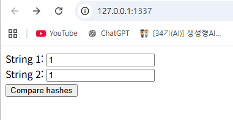

# what

: 
구분: 공통 문제
난이도: Easy
분야: Crypto, Web
상태: 작성 완료
생성일: 2026년 8월 8일 오후 7:43
수정일: 2026년 8월 9일 오후 10:09

# 0. 문제 정보

| 항목 | 내용 |
| --- | --- |
| 문제명 | What |
| 원본 대회 | BCACTF 2025 |
| 분야 | Web |
| 난이도 | 초급 · 약 1.5/5 |
| 접속 주소 | `http://localhost:1337` |
| 플래그 형식 | `FLAG{...}` |

# 문제 설명

두 개의 서로 다른 문자열을 입력해 서버의 검증을 통과하세요.

검증 조건을 우회해 서버에 저장된 플래그를 획득하는 것이 목표입니다.

[BCACTF-What-T34M-ROOKIE-Docker.zip](BCACTF-What-T34M-ROOKIE-Docker.zip)

# 1. 문제 요약



- 문제는 문자열 두개를 받고 해시값이 일치하면 flag가 나온다

---

# 2. 문제 분석

- 전체코드
    
    ```php
    <?php
        if ($_SERVER['REQUEST_METHOD'] === 'POST') {
            $str1 = $_POST['string1'] ?? '';
            $str2 = $_POST['string2'] ?? '';
    
            $hash1 = md5($str1);
            $hash2 = md5($str2);
    
            if ($str1 == $str2 || strlen($str1) > 100 || strlen($str2) > 100 ||
                strlen($str1) < 5 || strlen($str2) < 5) {
                echo "No\n";
                exit;
            } else if ($hash1 == $hash2) {#문자열이 해시될때 앞부분이 같으면? 플래그가 뜬다?
                echo file_get_contents("flag.txt");
                exit;
            }
        }
    ?>
    
    <!DOCTYPE html>
    <html>
        <head>
            <title>What?</title>
        </head>
        <body>
            <form method="POST">
                <label for="string1">String 1:</label>
                <input type="text" name="string1" id="string1" required><br />
    
                <label for="string2">String 2:</label>
                <input type="text" name="string2" id="string2" required><br />
    
                <input type="submit" value="Compare hashes" />
            </form>
        </body>
    </html>
    
    ```
    

주요 코드 

```php
				#해시 입력         
        $hash1 = md5($str1);
        $hash2 = md5($str2);
				
				#해시확인
        if ($str1 == $str2 || strlen($str1) > 100 || strlen($str2) > 100 ||
            strlen($str1) < 5 || strlen($str2) < 5) {
            echo "No\n";
            exit;
        } else if ($hash1 == $hash2) {
            echo file_get_contents("flag.txt");
            exit;
        }
```

---

# 3. 풀이과정

  1.    md5 해시 충돌이 일어나는 입력값 2개를 찾는다. 

- 구글링을 통해서 찾았습니다.

https://www.johndcook.com/blog/2024/03/20/md5-hash-collision/

- TEXTCOLLBYfGiJUETHQ4hAcKSMd5zYpgqf1YRDhkmxHkhPWptrkoyz28wnI9V0aHeAuaKnak
- TEXTCOLLBYfGiJUETHQ4hEcKSMd5zYpgqf1YRDhkmxHkhPWptrkoyz28wnI9V0aHeAuaKnak

1. 입력값 2개를 바탕으로 flag를 획득한다. 


---

# 4. 보안조치

- MD5는 충돌 공격에 취약하여 서로 다른 입력에 대해 동일한 해시값을 생성할 수 있으며, 연산 속도가 빨라 비밀번호 저장 시 무차별 대입 및 사전 공격에도 취약하다.
- 보안 목적의 무결성 검증이나 비밀번호 저장에는 사용하지 않는다.
- php에서 ==같은 느슨한 비교를 사용하지 않는다

---

# 5. 기록

- fastcoll 도구를 사용하면 쉽게 해시 충돌을 만들 수 있다.→ md5 충돌 파일

```php
sudo apt update
sudo apt install -y build-essential libboost-all-dev
```

```php
git clone https://github.com/brimstone/fastcoll.git
cd fastcoll
make
```

make가 안된다면

```php
g++ -O3 -DBOOST_TIMER_ENABLE_DEPRECATED *.cpp -o fastcoll \
  -lboost_program_options \
  -lboost_filesystem \
  -lboost_system
```

```php
sudo cp fastcoll /usr/local/bin/
```

```php
import subprocess
import hashlib

prefix = b"CTF-test\n"

with open("prefix.bin", "wb") as f:
    f.write(prefix)

subprocess.run([
    "/home/yt/fastcoll/fastcoll",
    "-p", "prefix.bin",
    "-o", "collision1.bin", "collision2.bin"
], check=True)

with open("collision1.bin", "rb") as f:
    a = f.read()

with open("collision2.bin", "rb") as f:
    b = f.read()

print("\n===== 결과 =====")
print("서로 다른가:", a != b)
print("길이 #1:", len(a))
print("길이 #2:", len(b))

print("\n===== MD5 =====")
print("MD5 #1:", hashlib.md5(a).hexdigest())
print("MD5 #2:", hashlib.md5(b).hexdigest())
print("해시 동일:", hashlib.md5(a).digest() == hashlib.md5(b).digest())

print("\n===== RAW 값 =====")
print("collision1:", repr(a))
print("collision2:", repr(b))

print("\n===== HEX 값 =====")
print("collision1:", a.hex())
print("collision2:", b.hex())
```


| 개념 | 공격자에게 주어지는 것 | 목표 |
| --- | --- | --- |
| 약한 충돌 저항성 | `m1`이 이미 정해져 있음 | 다른 `m2`를 찾아 `H(m1)=H(m2)` |
| 강한 충돌 저항성 | 아무것도 정해지지 않음 | 서로 다른 `m1`, `m2`를 둘 다 찾아 `H(m1)=H(m2)` |

https://jihyeong-ji99hy99.tistory.com/67

**A == B 를 비교하면 두개의 자료형이 달라도 데이터만 일치하다면 TRUE를 반환**한다.

**( 이를 방지하기 위해서는 A === B 를 사용하면 된다. )**

https://ch4njun.tistory.com/66

0e + 숫자(0~9)만 계속→ 0 × 10^99999 = 0

