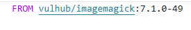

# Wizard Gallery

: 
구분: 공통 문제
난이도: Medium
분야: Web
상태: 작성 완료
생성일: 2026년 8월 9일 오전 12:32
수정일: 2026년 9월 2일 오후 1:24

# 0. 문제 정보

| 항목 | 내용 |
| --- | --- |
| 문제명 | Wizard Gallery |
| 원본 대회 | scriptCTF 2025 |
| 분야 | Web |
| 난이도 | 초급~중급 · 약 3/5 |
| 접속 주소 | `http://localhost:1337` |
| 플래그 형식 | `FLAG{...}` |

## 문제 설명

Wizard Gallery는 사용자가 이미지를 업로드하고 갤러리에서 확인할 수 있는 서비스입니다.

파일 업로드와 이미지 처리 과정에서 발생하는 취약점을 찾아 서버에 저장된 플래그를 획득하는 것이 목표입니다.

# 1. 문제 요약

- 이미지를 업로드하고 보여주는 사이트에서 magick를 사용한다.
- ../logo.png로 현재 로고를 덮어씌우고 logo-sm.png 엔드포인트에서 CVE-2022-44268를 사용한다.
- magick에 CVE-2022-44268  주요 정보를 노출을 통해flag를 획득한다.

---

# 2. 문제 분석

- 전체코드
    
    ```php
    #!/usr/local/bin/python3
    from flask import Flask, send_from_directory, request, jsonify
    import os
    
    app = Flask(__name__)
    
    UPLOAD_FOLDER = os.path.join(os.path.dirname(os.path.abspath(__file__)), 'uploads')
    ALLOWED_EXTENSIONS = {'png', 'jpg', 'jpeg', 'gif', 'bmp', 'webp'}
    BLOCKED_EXTENSIONS = {'exe', 'jar', 'py', 'pyc', 'php', 'js', 'sh', 'bat', 'cmd', 'com', 'scr', 'vbs', 'pl', 'rb', 'go', 'rs', 'c', 'cpp', 'h'}
    MAX_CONTENT_LENGTH = 10 * 1024 * 1024
    
    app.config['UPLOAD_FOLDER'] = UPLOAD_FOLDER
    app.config['MAX_CONTENT_LENGTH'] = MAX_CONTENT_LENGTH
    
    PUBLIC_DIR = os.path.join(os.path.dirname(os.path.abspath(__file__)), 'public')
    
    def allowed_file(filename):
        if '.' not in filename:
            return False
        basename = os.path.basename(filename)
        if '.' not in basename:
            return False
        extension = basename.rsplit('.', 1)[1].lower()
        if extension in BLOCKED_EXTENSIONS:
            return False
        return extension in ALLOWED_EXTENSIONS
    
    def is_blocked_extension(filename):
        if '.' not in filename:
            return False
        basename = os.path.basename(filename)
        if '.' not in basename:
            return False
        extension = basename.rsplit('.', 1)[1].lower()
        return extension in BLOCKED_EXTENSIONS
    
    # Remove all files in uploads to prevent malicious files from spreading
    def wipe_upload_directory():
        if os.path.exists(UPLOAD_FOLDER):
            for filename in os.listdir(UPLOAD_FOLDER):
                file_path = os.path.join(UPLOAD_FOLDER, filename)
                try:
                    if os.path.isfile(file_path):
                        os.unlink(file_path)
                except Exception as e:
                    pass
    
    def get_file_size_mb(file_path):
        return round(os.path.getsize(file_path) / (1024 * 1024), 2)
    
    @app.route('/')
    def home():
        return send_from_directory(PUBLIC_DIR, 'index.html')
    
    @app.route('/logo.png')
    def logo():
        return send_from_directory(os.path.dirname(os.path.abspath(__file__)), 'logo.png')
    
    @app.route('/logo-sm.png')
    def logo_small():
        # A smaller images looks better on mobile so I just resize it and serve that
        logo_sm_path = os.path.join(app.config['UPLOAD_FOLDER'], 'logo-sm.png')
        if not os.path.exists(logo_sm_path):
            os.system("magick/bin/convert logo.png -resize 10% " + os.path.join(app.config['UPLOAD_FOLDER'], 'logo-sm.png'))
        
        return send_from_directory(app.config['UPLOAD_FOLDER'], 'logo-sm.png')
    
    @app.route('/upload', methods=['POST'])
    def upload_file():
        # Can't upload nothing, right?
        if 'file' not in request.files:
            return jsonify({'success': False, 'message': 'No file selected! Please choose a magical image to upload.'}), 400
        
        file = request.files['file']
        
        if file.filename == '':
            return jsonify({'success': False, 'message': 'No file selected! Please choose a magical image to upload.'}), 400
        
        # Prevent uploading dangerous files
        # .파일 제거 
        if '.' not in file.filename:
            wipe_upload_directory()
            return jsonify({'success': False, 'message': '🚨 ATTACK DETECTED! Suspicious file without extension detected on the union network. All gallery files have been wiped for security. The Sorcerer\'s Council has been notified.'}), 403
    
        #extension BLOCKED_EXTENSIONS = {'exe', 'jar', 'py', 'pyc', 'php', 'js', 'sh', 'bat', 'cmd', 'com', 'scr', 'vbs', 'pl', 'rb', 'go', 'rs', 'c', 'cpp', 'h'}
        if is_blocked_extension(file.filename):
            wipe_upload_directory()
            return jsonify({'success': False, 'message': '🚨 ATTACK DETECTED! Malicious executable detected on the union network. All gallery files have been wiped for security. The Sorcerer\'s Council has been notified.'}), 403
        
        if file and allowed_file(file.filename):
            original_filename = file.filename
            
            file_path = os.path.join(app.config['UPLOAD_FOLDER'], original_filename)
            
            file.save(file_path)
            
            file_size = get_file_size_mb(file_path)
            
            return jsonify({
                'success': True, 
                'message': f'🎉 Spell cast successfully! "{original_filename}" has been added to the gallery ({file_size} MB)',
                'redirect': '/gallery'
            })
        else: #여기서 걸림
            return jsonify({'success': False, 'message': 'Invalid file type! Only magical images (PNG, JPG, JPEG, GIF, BMP, WEBP) are allowed.'}), 400
    
    @app.route('/gallery')
    def gallery():
        return send_from_directory(PUBLIC_DIR, 'gallery.html')
    
    @app.route('/api/gallery')
    def api_gallery():
        uploaded_files = []
        
        if os.path.exists(app.config['UPLOAD_FOLDER']):
            for filename in os.listdir(app.config['UPLOAD_FOLDER']):
                # Don't want to show logo-sm.png on the gallery
                if filename == 'logo-sm.png':
                    continue
                if allowed_file(filename):
                    file_path = os.path.join(app.config['UPLOAD_FOLDER'], filename)
                    file_size = get_file_size_mb(file_path)
                    
                    uploaded_files.append({
                        'filename': filename,
                        'original_name': filename,
                        'size_mb': file_size,
                        'extension': filename.rsplit('.', 1)[1].lower() if '.' in filename else 'unknown'
                    })
        
        return jsonify(uploaded_files)
    
    @app.route('/uploads/<filename>')
    def uploaded_file(filename):
        # Make sure to handle the case where the file is logo-sm.png (not part of the vault)
        if filename == 'logo-sm.png':
            return "File not found", 404
        return send_from_directory(app.config['UPLOAD_FOLDER'], filename)
    
    # Serve all files from public to /
    @app.route('/<path:filename>')
    def serve_files(filename):
        try:
            return send_from_directory(PUBLIC_DIR, filename)
        except:
            return "File not found", 404
    
    if __name__ == '__main__':
        # Make upload directory
        if not os.path.exists(UPLOAD_FOLDER):
            os.makedirs(UPLOAD_FOLDER)
        
        app.run(debug=True, host='0.0.0.0', port=5000)
    ```
    

```php
flask - /( /에서 이미지 올리고 ->/upload)
			- /upload 파일 확장자 검사
			- /gallery 파일들 보여주는 곳
			- /logo-sm.png (logo를 logo-sm로 변환<- 취약코드)
```

### magick?

- ImageMagick은 이미지 파일을 서버나 명령줄에서 변환·처리하는 오픈소스 이미지 처리 프로그램
- 웹 서비스에서 이미지 처리 자동화(ex. 크기 줄이기, 썸네일 만들기, 용량 압축)

---

# 3. 풀이과정

- 삽질 … → 파일 업로드 우회 실패, logo→ logo-sm→imagemagick
- docker에서 imagemagick 버전 확인
- magick 해당 버전에 맞는cve찾기
- CVE-2022-44268 페이로드만들기
- flag획득

### 3-1 docker에서 imagemagick 버전 확인



### 3-2 magick 해당 버전에 맞는cve찾기


### cve-2022-44268?

- png 파일의 구조

```php
PNG
├─ IHDR      이미지 크기/형식
├─ IDAT      실제 픽셀 데이터
├─ tEXt      텍스트 메타데이터
├─ iTXt      국제화 텍스트
├─ 기타 chunk
└─ IEND
```

- 메타데이터(GPS, 카메라 정보, 날짜, 작성자 등)에 외부 profile을 가리키는 코드를 삽입
- ImageMagick의 PNG 처리 로직이 해당 경로의 파일을 읽고 저장

### 3.3 CVE-2022-44268 페이로드만들기

[https://git.rotfl.io/v/CVE-2022-44268](https://git.rotfl.io/v/CVE-2022-44268)← rust [https://rust-lang.org/tools/install/](https://rust-lang.org/tools/install/)

[https://github.com/vulhub/vulhub/blob/master/imagemagick/CVE-2022-44268/poc.py](https://github.com/vulhub/vulhub/blob/master/imagemagick/CVE-2022-44268/poc.py)


[image.zip](image.zip)


### 4.4 flag획득


---

# 4. 보안조치

- 취약한 ImageMagick 버전 업데이트
- ImageMagick 권한 최소화
- ImageMagick 보안 정책 설정을 이용해서 불필요한 파일 접근 제한

---

# 5. 기록

ImageTragick (CVE-2016-3714)← svg로 임의코드실행

[https://blog.alyac.co.kr/632](https://blog.alyac.co.kr/632)

[https://git.rotfl.io/v/CVE-2022-44268](https://git.rotfl.io/v/CVE-2022-44268)← rust [https://rust-lang.org/tools/install/](https://rust-lang.org/tools/install/)

[https://github.com/vulhub/vulhub/blob/master/imagemagick/CVE-2022-44268/poc.py](https://github.com/vulhub/vulhub/blob/master/imagemagick/CVE-2022-44268/poc.py)