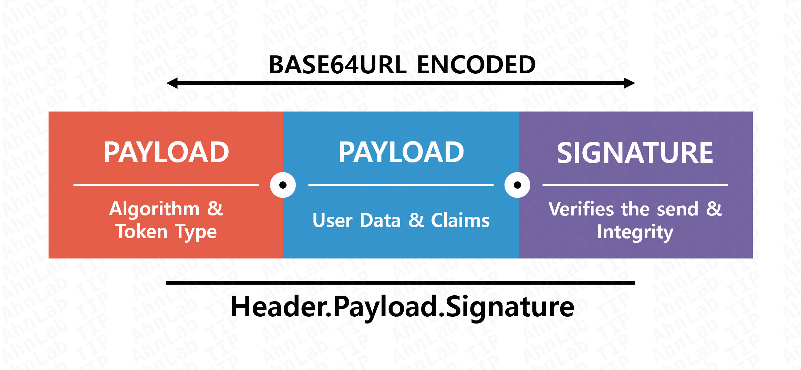

# vibe coder

구분: 공통 문제
난이도: Easy
분야: Web
상태: 작성 완료
생성일: 2026년 8월 22일 오후 9:10
수정일: 2026년 8월 30일 오후 2:38

# 0. 문제 정보

# 문제 정보

| 항목 | 내용 |
| --- | --- |
| 문제명 | Vibecoder |
| 원본 대회 | Welcome CTF 2025 |
| 분야 | Web |
| 난이도 | 초급 · 약 1/5 |
| 접속 주소 | `http://localhost:1340` |
| 플래그 형식 | `FLAG{...}` |

# 1. 문제 요약

- 로그인하는 기능이 있는 무제
- JWT 토큰을 위조해 admin으로 위조

---

# 2. 문제 분석

```python
flask - /로그인 관련 jwt를 발급하고 파싱
```

```python
def parse_jwt(token):
    header_b64, payload_b64, *_ = token.split('.')
    padded_header = header_b64 + '=' * (-len(header_b64) % 4)
    header = json.loads(base64.urlsafe_b64decode(padded_header))
    alg = header.get('alg', 'HS256')

    # Intentionally vulnerable: unsigned JWTs are trusted.
    if alg == 'none':
        padded_payload = payload_b64 + '=' * (-len(payload_b64) % 4)
        return json.loads(base64.urlsafe_b64decode(padded_payload))
    return jwt.decode(token, SECRET_KEY, algorithms=[alg])
    
    
-> 파싱한 값  payload = parse_jwt(token)
            if payload.get('admin'):
                return render_template('welcome.html', title='Welcome admin!', message='Administrative secret:', flag=FLAG, token=token)
            return render_template('welcome.html', title='Welcome!', message='Your account is not an administrator.', flag=None, token=token)

```



---

# 3. 풀이과정

jwt.io에서 jwt 위조 

[https://www.jwt.io/](https://www.jwt.io/)


---

# 4. 보안조치

JWT 라이브러리를 사용하더라도, 개발자는 표준 스펙에서 허용하는 모든 잠재적 위험을 명시적으로 차단해야 한다.

**1. 알고리즘 화이트리스트 강제화**

JWT 검증 시, 서버가 허용하는 알고리즘(예: RS256)을 라이브러리에 명시적으로 고정해야 한다. 이는 alg=none 같은 안전하지 않은 알고리즘의 수용을 차단하고, 알고리즘 혼동 공격 시도를 무력화한다.

**2. Critical Claims에 대한 Strict Validation**

exp (만료 시간), iss (발급자), aud (수신자) 등 표준 클레임에 대한 검증을 누락 없이 수행하도록 한다. Access Token을 수신할 때 exp 유효성 검증을 통해 만료된 토큰 사용을 차단해야 한다.

**3. 키 참조 매개변수 방어**

kid, jku, jwk 같은 동적 키 참조 메커니즘은 주입 공격 벡터를 제공하므로, 사용을 지양해야 한다. 불가피하게 사용해야 할 경우, kid 값에 대해 Path Traversal 패턴 및 SQL Injection 패턴을 포함한 강력한 입력 필터링(화이트리스트 기반)을 적용할 것을 권고한다.

---

# 5. 기록

[https://asec.ahnlab.com/ko/91594/](https://asec.ahnlab.com/ko/91594/)

**JWT 인증 방식**

반면 JWT 인증 방식은 세션 기반 인증의 단점을 어느 정도 해소한다.

Stateless 구조로 별도의 세션 저장소 없이 서명 검증만으로 기본 인증이 가능서버/인스턴스 간 세션 동기화가 필요 없어 수평 확장에 유리각 서비스가 토큰을 직접 검증할 수 있어 마이크로서비스 아키텍처에 친화적토큰에 사용자 식별자, 권한, 만료 시간 등을 포함하여 서버 상태에 대한 의존도를 줄임

- Stateless 구조로 별도의 세션 저장소 없이 서명 검증만으로 기본 인증이 가능
- 서버/인스턴스 간 세션 동기화가 필요 없어 수평 확장에 유리
- 각 서비스가 토큰을 직접 검증할 수 있어 마이크로서비스 아키텍처에 친화적
- 토큰에 사용자 식별자, 권한, 만료 시간 등을 포함하여 서버 상태에 대한 의존도를 줄임