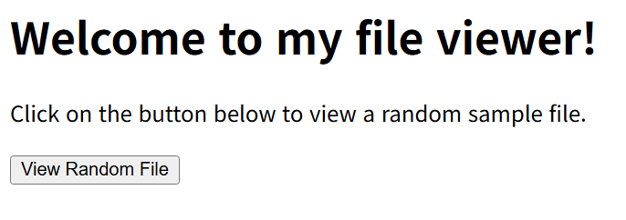

# file_viewer

: 유영택
구분: 공통 문제
난이도: Easy
분야: Web
상태: 작성 완료
생성일: 2026년 8월 31일 오후 5:45
수정일: 2026년 8월 31일 오후 6:03

# 0. 문제 정보

| 항목 | 내용 |
| --- | --- |
| 문제명 | file_viewer |
| 원본 대회 | Lexington Informatics Tournament CTF 2025 |
| 분야 | Web |
| 난이도 | 초급~중급 · 약 1/5 |
| 접속 주소 | `http://localhost:1351` |
| 플래그 형식 | `FLAG{...}` |

# 1. 문제 요약



- [http://127.0.0.1:1351/view-file?file=sample2.txt](http://127.0.0.1:1351/view-file?file=sample2.txt) 같이 sample파일을 쿼리스트링을 통해서 요청하고 보여준다.
- 쿼리스트링에 ../flag를 입력해 파일을 받아 확인한다. ← flag.txt였으면 보였을텐데 이건 문제 만들면서 txt가 빠졌나보네요

---

# 2. 문제 분석

주요 엔드포인트

```python
@app.route('/view-file')
def view_file():
    filename = request.args.get('file', '')
    filepath = os.path.join('files', filename)
    
    if not os.path.exists(filepath):
        return abort(404)
    
    return send_file(filepath)
```

### file명 확인하기 ← 화이트박스라 가능한 방법들

dockerfile 여기서 docker-entry포인트가 먼저 실행되는 걸 알 수 있음


docker-entry.py


원래는 app폴더에 flag.txt가 들어있는데 제가 바로 안보이게 하려구 간단한 xor 암호화 하다가 txt가 빠졌네요

### 도커 컨테이너 파일에서 확인하기


---

# 3. 풀이과정

- /view-file에 쿼리스트링으로 ../flag입력
- [http://127.0.0.1:1351/view-file?file=../flag](http://127.0.0.1:1351/view-file?file=flag)

확인


---

# 4. 보안조치

- 사용자 입력값을 파일 경로에 직접 사용하지 않도록 검증 및 정규화해야 한다.
- 허용된 디렉터리 외부로 접근하지 못하도록 `safe_join()` 또는 `send_from_directory()`를 사용해야 한다.
- `../` 등 경로 이동 문자열을 차단하고 허용된 파일만 접근할 수 있도록 제한해야 한다.

---

# 5. 기록