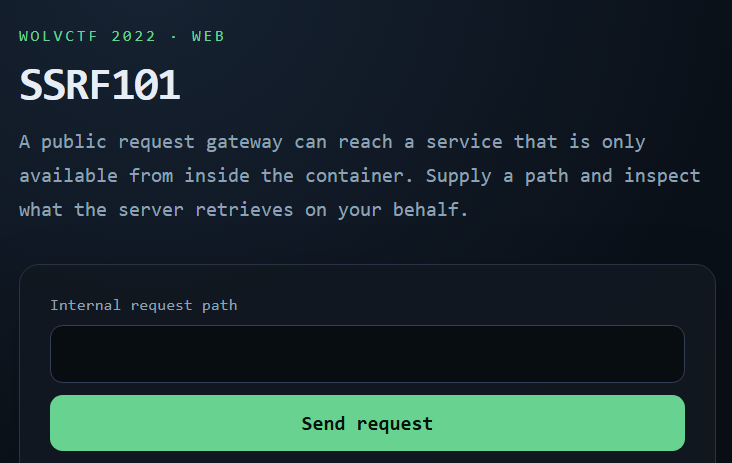

# SSRF101

# 0. 문제 정보

| 항목 | 내용 |
| --- | --- |
| 문제명 | SSRF101 |
| 원본 대회 | WolvCTF 2022 |
| 분야 | Web · SSRF |
| 난이도 | 초급 · 약 2/5 |
| 접속 주소 | `http://localhost:1360` |
| 플래그 형식 | `FLAG{...}` |

WolvCTF 2022의 `SSRF101` 문제입니다. 외부에서 접근 가능한 웹 서비스가 서버 내부의 다른 서비스에 요청을 보내는 구조를 분석하는 SSRF 입문 문제입니다.



# 1. 문제 요약

- public, server1, server2총 3개가 포트가 열려있고 server1,2는 내부 요청만 가능하다.
- public을 통해서 server1을 요청이 가능하지만 server2로는 요청이 안간다
- server2를 내부요청으로 /flag를 요청해야한다.

---

# 2. 문제 분석

- public

```python
express - / (index반환)
				- /source (text파일 읽기)
				-/ssrf (url요청 http://localhost:${private1Port}${path} 1번서버로)
```

- server1

```python
express - / (private1.js반환)
				- /private2 (private2.js 읽기)
```

- server2

```python
express - / (/private2.js 반환)
				- /flag (flag파일 읽기)
```

---

# 3. 풀이과정

/ssrf (url요청 http://localhost:${private1Port}${path} 1번서버로)이 부분을 변경해야함 앞에 localhost:port를 바꿔서 이걸 우회해서 private2의 port로 변경해야한다. 

URL에 FTP/HTTP 인증 정보를 직접 넣을 수 있게 하려고 존재하는 문법인 @를 사용 @앞부분은 userinfo, 뒷부분은 호스트로 해석되는 것을 이용해 우회

@localhost:10011/flag요청


---

# 4. 보안조치

- SSRF 요청에 사용되는 URL을 그대로 신뢰하지 말고, 서버가 접근할 수 있는 호스트와 포트를 허용 목록(Allowlist) 방식으로 제한해야 한다.
- `localhost`, `127.0.0.1`, 사설 IP 대역 등 내부 네트워크 주소로의 요청을 차단하여 외부 사용자가 내부 서비스에 접근하지 못하도록 해야 한다.
- URL의 `userinfo` 문법(`user@host`)처럼 파싱 결과를 바꿀 수 있는 입력을 제한하고, 단순 문자열 검사보다 URL 파서를 이용해 실제 최종 호스트를 검증해야 한다.
- 리다이렉트가 허용되는 경우 최초 URL만 검사하지 말고, 리다이렉트 이후의 목적지까지 다시 검증해야 한다.
- 내부 서비스는 웹 애플리케이션에서 접근할 수 있다는 이유만으로 신뢰하지 말고, 인증이나 네트워크 접근 제어를 추가해 직접적인 `/flag` 같은 민감 경로 접근을 막아야 한다.

---

# 5. 기록

특히 URL에서 `@` 앞부분은 `userinfo`, 뒷부분은 실제 요청 대상 호스트로 해석될 수 있다는 점을 이용해, 애플리케이션이 의도한 `server1`이 아닌 `server2`로 요청 대상을 변경할 수 있었다.