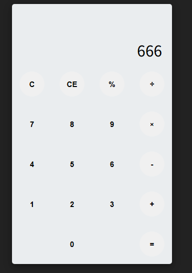

# A Simple Calculator

# 0. 문제 정보

| 항목 | 내용 |
| --- | --- |
| 문제명 | A Simple Calculator |
| 원본 대회 | UMDCTF 2022 |
| 분야 | Web · Code Injection |
| 난이도 | 초급 · 약 2/5 |
| 접속 주소 | `http://localhost:5000` |
| 플래그 형식 | `FLAG{...}` |

# 1. 문제 요약



- 간단한 계산기 웹 앱
- Post요청을 기반으로 데이터 입력
- eval을 사용해 사용자 입력을 동적으로 계산

---

# 2. 문제 분석

Source = request.json['f']
Processing/Validation = z()
Sink = eval()
Target = enc_flag

```python
app.route('/')
def home():
    return render_template('index.html')

@app.route('/public/<path:path>')
def send_public(path):
    return send_from_directory('public', path)

@app.route('/calc', methods=['POST'])
def calc():
    val = 0
    try:
        z(request.json['f'])
        val = f"{int(eval(request.json['f']))}" #<-sink 
    except Exception as e:
        val = 0

    response = app.response_class(
        response=json.dumps({'result': val}),
        status=200,
        mimetype='application/json'
    )
    return response
```

```python
def encrypt(text: str, key: int):
    result = ''

    for c in text:
        if c.isupper():
            c_index = ord(c) - ord('A')
            c_shifted = (c_index + key) % 26 + ord('A')
            result += chr(c_shifted)
        elif c.islower():
            c_index = ord(c) - ord('a')
            c_shifted = (c_index + key) % 26 + ord('a')
            result += chr(c_shifted)
        elif c.isdigit():
            c_new = (int(c) + key) % 10
            result += str(c_new)
        else:
            result += c

    return result
```

## eval

`eval()`은 문자열을 Python 표현식(expression)으로 해석해서 실제로 실행하고, 그 결과값을 반환하는 함수

eval은 expression만 받는다. expression은 실행했을 때 하나의 값(value)이 나오는 코드(ex len("abc"), eval("import os")← 안됨)

동작

```python
문자열 입력
→ Python 표현식으로 파싱
→ AST 생성<- 여기서 함수 호출, attribute 접근, indexing 같은 문법 구조를 인식
→ 바이트코드로 컴파일
→ 현재 globals/locals 기준으로 실행<-  실제 객체 조회, attribute 접근, 함수/method 호출
→ 결과값 반환
```

`eval()`이 위험한 이유는 단순한 산술 연산뿐 아니라 Python expression이 허용하는 함수 호출, attribute 접근, 객체 참조 등을 실제로 실행할 수 있기 때문에, 사용자 입력이 직접 들어가면 코드 인젝션으로 이어질 수 있기 때문이다.

---

# 3. 풀이과정

- eval에 flag_enc를 가져온다. int.from_bytes(, "big") 를 통해 byte→int


- enc암호화가 +7로 했으니 -7로 복호화

```python
n = 38455679423667937726014165224253116727881963265506684586141730033812950776511392782173309

b = n.to_bytes((n.bit_length() + 7) // 8, "big")

def encrypt(text: str, key: int):
    result = ''

    for c in text:
        if c.isupper():
            c_index = ord(c) - ord('A')
            c_shifted = (c_index + key) % 26 + ord('A')
            result += chr(c_shifted)
        elif c.islower():
            c_index = ord(c) - ord('a')
            c_shifted = (c_index + key) % 26 + ord('a')
            result += chr(c_shifted)
        elif c.isdigit():
            c_new = (int(c) + key) % 10
            result += str(c_new)
        else:
            result += c

    return result

enc = b.decode()
print(encrypt(enc, -7))
```


---

# 4. 보안조치

- 사용자 입력을 eval()에 직접 넣지 않는다.
- 가능하면 ast.literal_eval()이나 허용 연산만 처리하는 별도 파서를 사용한다.
- 꼭 써야 하면 allowlist 검증과 실행 환경 격리를 같이 적용한다.

---

# 5. 기록